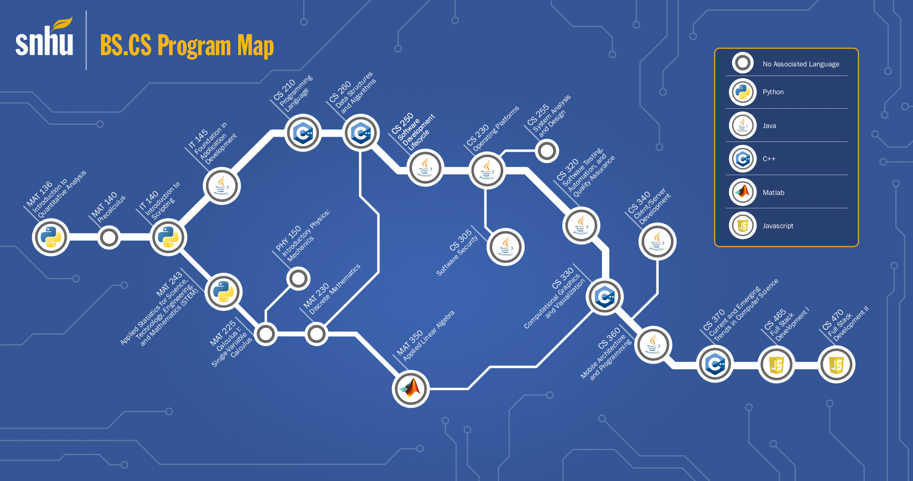

## Summary

I am an undergraduate student at Southern New Hampshire University majoring in computer science with a minor in mathematics and a concentration in data analysis. My main interests are system programming, computer networks, machine learning and bioinformatics.

## Coursework

SNHU Coursework

| __Course name__ | __Course number__ |
|-----------------|-------------------|
| __Core CS coursework__ | |
| [Programming Languages](./coursework/CS210/) | CS210 |
| [Operating Platforms](./coursework/CS230/) | CS230 |
| [Software Development Life Cycle](./coursework/CS250/) | CS250 |
| [System Analysis and Design](./coursework/CS255/) | CS255 |
| [Secure Coding](./coursework/CS305/) |CS305 |
| [Software Testing Automation & QA](./coursework/CS320/) | CS320 |
| [Client/Server Development](./coursework/CS340) | CS340 |
| [Introduction to Structured Database Environments](./coursework/DAD220/) | DAD220 |
| __General STEM coursework__ | |
| [Precalculus](./coursework/MAT140/) | MAT140 |
| [Introduction to Physics](./coursework/PHY150/) | PHY150 |
| [Calculus I: Single-Variable Calculus] | MAT225 |
| [Discrete Mathematics](./coursework/MAT230) | MAT230 |
| __Other prerequisite coursework__ | |
| [Perspectives in History](./coursework/HIS100/) | HIS100 |
| [Applied History](./coursework/HIS200/) | HIS200 |
| [Perspectives in Social Science](./coursework/SCS100/) | SCS100 |
| [Applied Social Science](./coursework/SCS200/) | SCS200 |

Test-Out Courses

 

A partial list of courses offered by third-party providers that I took, and then articulated to college credit at SNHU:

|__Third-party course__|__Provider__|__SNHU equivalent__|
|----------------------|------------|-------------------|
| [Introduction to Computer Science and Programming Using Python](https://courses.edx.org/certificates/ba83ef4d67d94dca87154ed312181845) | edX | IT-140: Introduction to Scripting |
| [Introduction to Java Programming](./sundries/ossu/coursework/Sophia_IT-145) | Sophia Learning | IT-145: Foundations of Application Development |
| [CS-201: Data Structures & Algorithms](./sundries/ossu/coursework/Study.com_CS-201) | Study.com | CS-300: DSA: Analysis and Design |
| Data Analysis | Coursera/Google | \[todo\] |

## Extracurricular Activities

Outside of school, I like to "stay sharp" by doing computer science practice with sundry textbook problems, and work on (semi-)arbitrary computing problems. I also like to dabble in other STEM and humanities related fields. These are some of the results from my extracurricular activities:

Open Source Society University (OSSU)

A significant educational project that I am working on is a (unaccredited, but cheap) set of STEM "majors" from the [Open Source Society University](https://github.com/ossu) - abbreviated to _OSSU_. This includes all of my other non-accredited coursework that may or may not be in the OSSU curriculum.

Textbook problems

* [(T) Starting Out with C++: From Control Structures through Objects (ISBN-13: 978-0-13-403732-5)](./sundries/Books/ISBN-13_978-0-13-403732-5)
* [(L) Bayesian Statistics the Fun Way (ISBN-13: 978-1-59327-956-1)](./sundries/Books/ISBN-13_978-1-59327-956-1)
* [(L) Matter and Interactions: Fourth Edition (ISBN-13: 978-1-59327-640-9)](./sundries/Books/ISBN-13_978-1-11887-586-5/)
* [(L) Dive Into Algorithms (ISBN-13: 978-1-7185-0068-6)](./sundries/Books/ISBN-13_978-1-7185-0068-6)
* [(L) Doing Math with Python (ISBN-13: 978-1-59327-640-9)](./sundries/Books/ISBN-13_978-1-59327-640-9/)

_Note to self: T = todo and L = later_

Online code judges

* [CodeSignal](./sundries/OLCodeJudge/CodeSignal): general programming
* [DM::OJ](./sundries/OLCodeJudge/DMOJ): general programming
* [HackerRank](./sundries/OLCodeJudge/HackerRank): general programming
* [Project Euler](./sundries/OLCodeJudge/ProjectEuler): with a special focus on number theory and maths
* [Rosalind](./sundries/OLCodeJudge/Rosalind): with a special focus on bioinformatics

Capture The Flags (CTFs)

* picoCTF 2025: general beginner-level ctf challenges.
* [picoCTF 2023](./sundries/ctf/2023/picoCTF): general beginner-level ctf challenges.
* [BrixelCTF 2020](./sundries/ctf/2020/brixelctf): general beginner-level ctf challenges.
* [Decompetition 2020](./sundries/ctf/2020/decompetition): reverse engineering puzzles. Rather than trying to work out a "flag," participants are challenged to reengineer compiled binaries to best match the output of the original compiled executable.
* [FlareON 5](./sundries/ctf/2018/flareon5): ctf focused on reverse engineering.

InfoSec labs and CTF practice

* [ImmersiveLabs](./sundries/wargames/ImmersiveLabs): general infosec
* [TryHackMe](./sundries/wargames/TryHackMe): general infosec
* [crackmes.one](./sundries/wargames/crackmes.one): infosec with a special focus on reversing

## Auxiliary

LaTeX templates

* [APA paper](./auxiliary/latex-templates/apa-paper/)
* [RESEARCHERS.ONE paper](./auxiliary/latex-templates/resone-paper/)

