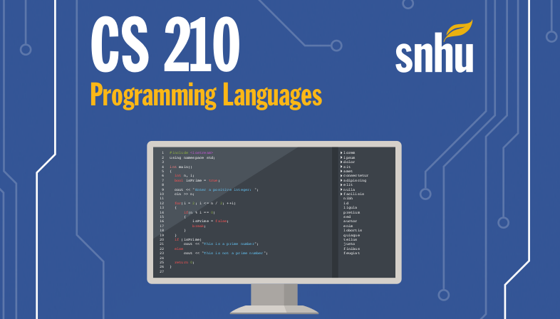

## Projects

Throughout this class, I have completed three programming projects to demonstrate my proficency regarding programming notions in the C++ language. My [spotlight project](./spotlight) is something of an asset management tool for grocery items (or any other kind of item). It uses object-oriented design, the notions of a pointer and reference, and other useful notions in coding. 

* [Spotlight Project](./spotlight):

I also present two other projects that I worked on in the class:

* [Project 1](./projects/p1): A simple C++ utility that keeps time.
* [Project 2](./projects/p2): A simple C++ accounting tool that works out compound interest.

## Programming Labs

These are smaller projects that I completed to demonstrate proficency in C++ coding constructs:

* [Module 1: Driving Costs](./labs/mod1): C++ programme to calculate a driving cost with a basic formula.
* [Module 2: Mad Libs](./labs/mod2): C++ programme to emulate the Mad Libs games.
* [Module 3: Vector Sorting](./labs/mod3): C++ programme to sort a ``vector`` with the Bubble Sort algorithm.
* [Module 4: Classes](./labs/mod4): A programme that demonstrates the object-oriented features of C++.
* [Module 5: File I/O](./labs/mod5): C++ programme that converts temperature and reads and writes the results into text files as a means to demonstrate file input/output operations.
* [Module 6: Exception handling](./labs/mod6): A programme that demonstrates exception handling in C++.
* [Module 7: The Linked List](./labs/mod7): C++ programme that implements a Linked List and demonstrates the use of pointers to get memory addresses.

## Coding Practice

Solutions to selected problems from the zyBooks textbook:

* [Module 1 Practice](): 
* [Module 2 Practice]():

## References

* Bibi, K. (2022). _Pass String by Reference in C++_. Linux Hint. Last Retrieved on Jun. 23, 2023 from: https://linuxhint.com/pass-string-reference-cpp/
* cplusplus.com (n.d.). ``std::set``. Last Retrieved on Jun. 23, 2023 from: https://cplusplus.com/reference/set/set/
* Rollbar Editorial Team (2021). _Throwing Exceptions in C++_. Last Retrieved on Jun. 23, 2023 from: https://rollbar.com/blog/error-exceptions-in-c/
* Techie Delight (n.d.). _Use an object as a key in_ ``std::set`` _in C++_. Last Retrieved on Jun. 23, 2023 from: https://www.techiedelight.com/use-object-key-stdset-cpp/
* Tutorials Point (n.d.). _Set_ ``insert()`` _in C++ STL_.
