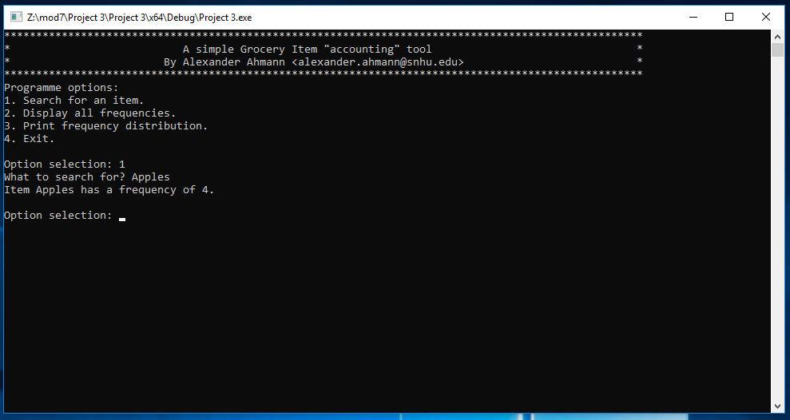
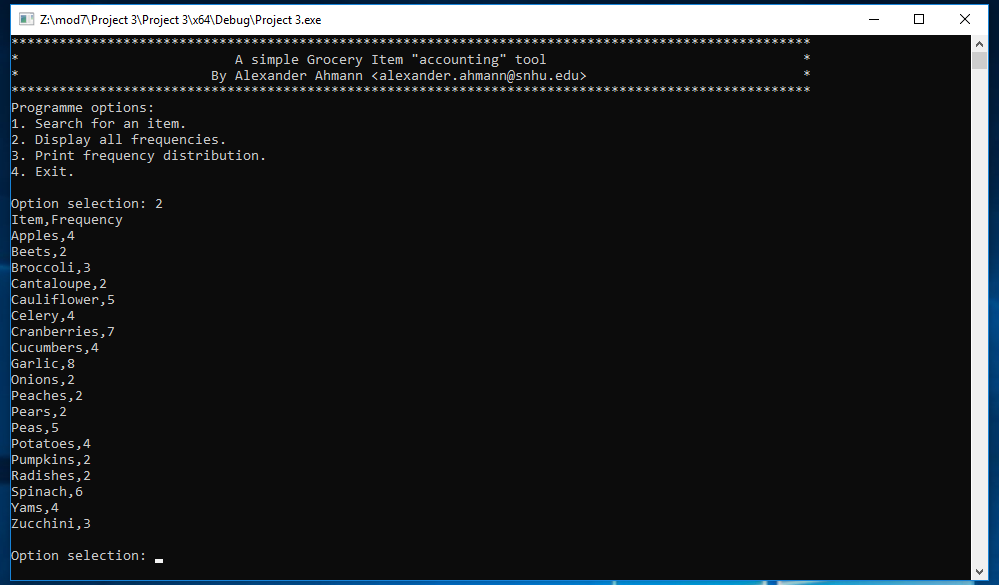
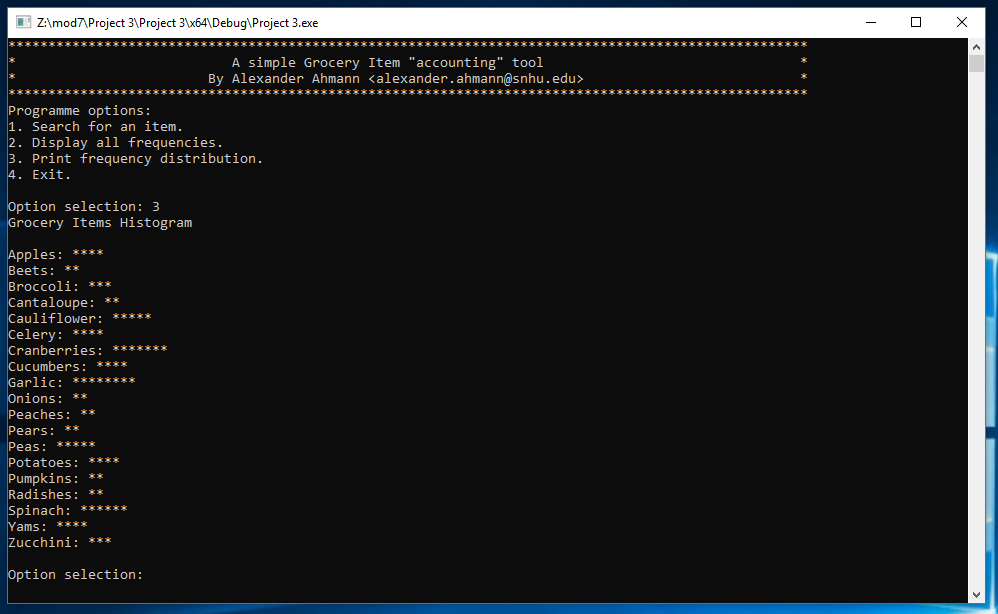

This is a simple utility that reads the text file ``inventory.txt`` which contains a list of items that can be found in a grocery store. The utility then calculates the frequency of each item in real time, and then computes the frequency of each item based on the number of times it appears in ``inventory.txt``. It can then print out the frequency of any and all items in the list, and can also print a frequency histogram into command prompt.

## Usage

### Search for a specific item

### Display all frequencies

### Display a frequency distribution

## "Behind the scenes"

### Discussion

* __Limitations__ 
    * From the teacher's feedback: sufficient documentation has not been 
