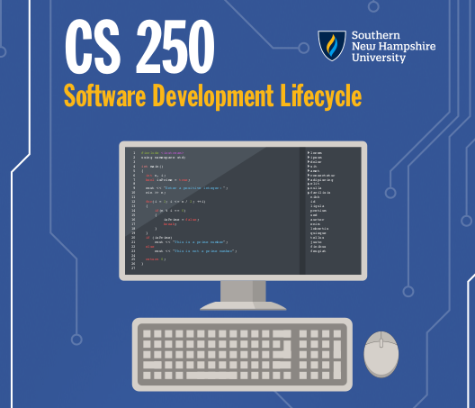

## Introduction

## Coursework

[tbd]

### Capstone Project

The following is the culmination of my work for this course:

* [Final Paper](./capstone/paper.pdf): this paper discusses applying the _Agile_ and _Scrum_ framework to a hypothetical software development firm called ChadaTech. I discuss the new model of software development, and different kinds of tools to make the software work. I also compare and contrast the older _Waterfall_ model to Agile.

* [Final Presentation](./capstone/pres.pdf): this is a PowerPoint presentation that introduces the Agile framework; which accompanies the final paper.

## Discussion

The following are my responses to the prompts given from _Assignment 8-2:_

### Interpreting User Needs (Prompt 1)

> "How do I interpret user needs and implement them into a program? How does creating 'user stories' help with this?"

The project manager will survey end-users, record their responses as "user stories," and then express their needs and wants as software engineering problems to be added to a project backlog. User stories are important, because they represent the demand needed for the product. Such demand can be made into a software engineering problem by a skilled project manager, which is then to be implemented by the developers and testers.

### Approach to Software Development (Prompt 2)

> "How do I approach developing programs? What Agile processes do I hope to incorporate into my future development work?"

The _Agile_ model, and its most relevant subset: _Scrum_, allows for developers and testers to collaborate with one-another, and with the project manager. This is all under the direction of the _Scrum Master_, who is an expert at the Agile/Scrum models, and who will mediate the communications between the project owner and developers.

A set of Scrum rituals are put forward to have developers discuss how to proceed next. The developers would rapidly develop and test functions that make up the greater software product. Then, they would deploy the software to the end user. New problems can be derived from the end-user's 

### Good Teamwork (Prompt 3)

> "What does it mean to be a good team member in software development?"

This is a rather tricky question with an answer that could honestly need a medium that is the size of a small novel to communicate. Nonetheless, here are some arbitrary qualities that I have identified:

1. __A healthy work ethic__: work hard, but not too hard. Find a nice life/work balance.
2. __Good communication skills__: in some cases, good communication between developers could trump technical skills --- at least in the Agile-driven team.

## References

[todo]

