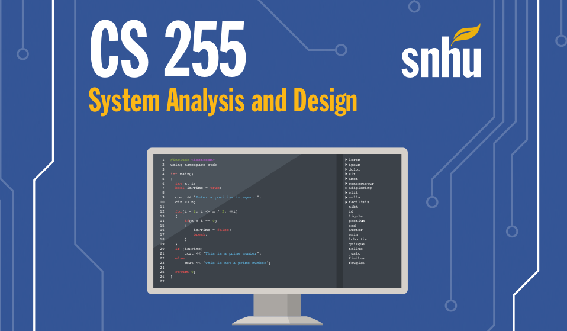

## Introduction

[todo]

## Coursework

### Capstone Project

This course had its students design a web application for the hypothetical education firm _DriverPass:_ which had the goal of helping students pass driving tests with courses, practice written tests, and renting cars for practical driving. The web application delievered the content and exams to prospective students, processed payments, and allowed for students to schedule appointments to rent cars for practice.

I think that I did a decent job building charts and graphics to visually describe systems and my vision for what their implementation, in the abstract at least, should look like. I feel that I may have hyperfixated on certain parts of the assignments, and maybe I could have spent more time on other sections. To determine clients needs and software requirements, I read an interview with them, took notes, and made their demands into an engineering problem. 

To design the software, I would first try to find a ["kludge"](https://en.wikipedia.org/wiki/Kludge) of a solution - or a quick solution that solves a specifc problem, but not in the most elegant way. I would then use this as a basis for building details into a systems diagram, write more mature implementations of code, and then refine the diagram and codebase as I get more information regarding the project. 

* Project 1: _Business Requirements Document_ \([docx](./projects/Project1_Business-Requirements-Documents.docx), [pdf](./Project1_Business-Requirements-Document.pdf)\).
* Project 2: _System Design Document_ \([docx](./projects/Project2_System-Design-Document.docx), [pdf](./projects/Project2_System-Design-Document.pdf)\).
    * _Client Presentation_ \([pptx](./projects/Project2_Client-Presentation.pptx), [pdf](./projects/Project2_Client-Presentation.pdf)\).
    
## Assignments

[todo]

