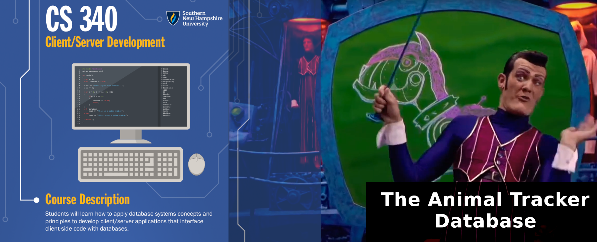
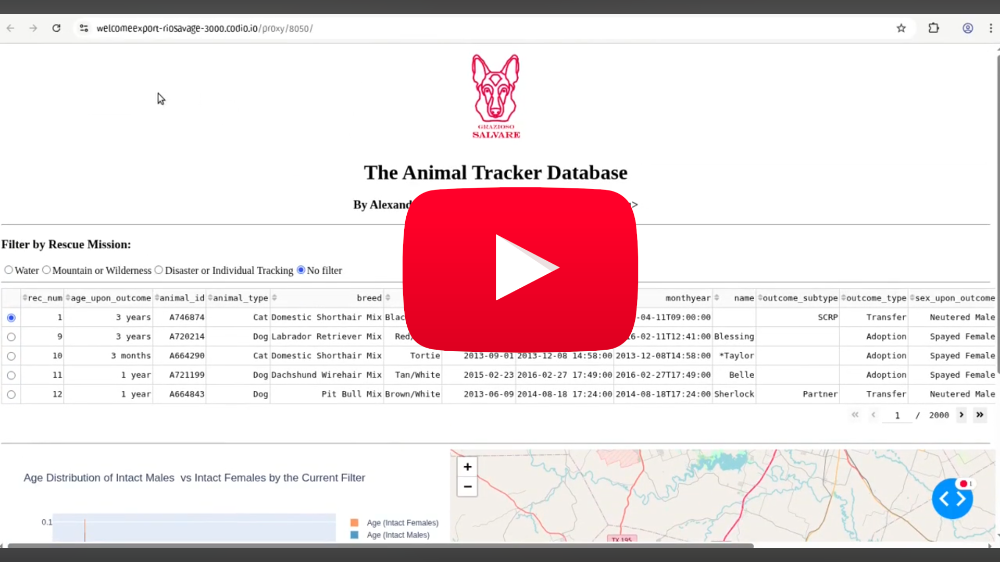

<b>Note that some of the banner's components are from: <a href="https://www.youtube.com/watch?v=VPVnFHBdWKM" target="_blank">Lidi (2020)</b></a>

> "\[In this course\], \[s\]tudents will learn how to apply database systems concepts and principles to develop client/server applications that interface client-side code with databases." ---[CS-340 Syllabus](./Syllabus.pdf)

_Client/Server Development (CS-340)_ is about developing client-side web applications that interact with various networked services. Specifically, this class concerns itself with the development of tools and web interfaces in the Python programming language to interact with the non-relational database management service called MongoDB. 

In this course, I have worked with with developing MongoDB queries for CRUD operations, using the Python ``pymongo`` library to interface with MongoDB instances, and then using Python's Dash framework to visualise datasets stored in the form of key/value pairs that constitute a "document" in a MongoDB "collection" of many other documents of the same kind.

## Project

The work done in this course culminated into a full-stack web application that I have called _The Animal Tracker Database_. It consists of a MongoDB database management system, a custom "Python CRUD Module," and a front-end web application written in the Python programming language, and invoking the Dash framework with its respective supporting third-party modules.

The __codebase__ consists of the following key programme files:

* [``CRUD_Python_Module.py``](./project/code/CRUD_Python_Module.py): the core library that consists of the _create, read update, and delete_ (CRUD) functionality to make transactions with a MongoDB server. 
    * [``CRUD_Test_Harness.py``](./project/code/CRUD_Test_Harness.py): a custom test harness that I used to test the ``CRUD_Python_Module.py`` functionality. __PLEASE NOTE THAT:__ these tests only demonstrate the Python CRUD Module's functionality as a proof-of-concept, __not as a mature product that can be deployed "into the wild."__
* [``Project_2_WebApp.py``](./project/code/Project_2_WebApp.py): the actual web application front-end that invokes the ``CRUD_Python_Module.py`` to make transactions with the MongoDB instance, and then render information in its database into interactive "easy to interpret" charts and tables.
* [``aac_shelter_outcomes.csv``](./project/code/aac_shelter_outcomes.csv): the [Animal Shelter (2016)](https://doi.org/10.26000/025.000001) dataset which was modelled by the web application.
* [``Jupyters.zip``](./project/code/Jupyters.zip): this is a ZIP archive of the source code of the Python Dash web application in the form of a Jupyter Notebook.

Furthermore, this project's development and usage has been documented in the form of comprehensive __technical writeups__, and more condensed __"README"-style usage manuals__. They can be accessed over at:

* Project 1 _README_: \([pdf](./project/CRUD%20Module%20README%20(Project%201).pdf), [docx](./project/CRUD%20Module%20README%20(Project%201).docx)\).
    * Project 1 _Technical Writeup_: \([pdf](./project/Project%201_Writeup.pdf)\).
* Project 2 _README_: \([pdf](./project/Python%20Dash%20WebApp%20README%20), [docx]()\).
    * Project 2 _Technical Writeup_: \([pdf](./project/Project%202_Writeup.pdf)\).

### Screencast

I have also prepared a screencast which demonstrates a usage of the front-end web application component of _The Animal Tracker Database_, which [can be watched on YouTube](https://www.youtube.com/watch?v=73yvD0kBQGE):

## Homework

Each module came with an "journaling" assignment, which existed to demonstrate competence in a particular aspect of the course, and/or to slowly develop the resulting Projects 1 and 2. 

* [Assignment 1-3](./homework/1-3) \([writeup](./homework/1-3/writeup.pdf)\): about data modelling with MongoDB.
* [Assignment 2-1](./homework/2-1) \([writeup](./homework/2-1/writeup.pdf)\): about CRUD transactions with MongoDB.
* [Assignment 3-1](./homework/3-1) \([writeup](./homework/3-1/writeup.pdf)\): about indexing and systems administration in MongoDB.
* [Assignment 4-1](./homework/4-1) \([writeup](./homework/4-1/writeup.pdf)\): about interacting with MongoDB with Python and ``pymongo``.
* [Assignment 5-2](./homework/5-2) \([writeup](./homework/5-2/writeup.pdf)\): introduction to the Python Dash framework for build web applications.
* [Assignment 6-1](./homework/6-1) \([writeup](./homework/6-1/writeup.pdf)\): about adding basic interactive components in a Dash webapp. 

### Course Textbook

This textbook was the primary reference when learning the concepts discussed in this course.

## Resources

\[todo\]
