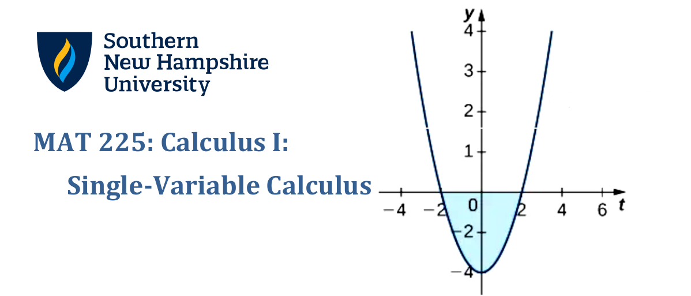

> "_Calculus is the mathematical study of change that has widespread applications in science, engineering, economics, and business. This course provides a rigorous introduction to single-variable calculus. Topics include limits, continuity, differentiation, and integration of algebraic, trigonometric, exponential, and logarithmic functions, applications of derivatives, and integration, including the Fundamental Theorem of Calculus. This course will encourage students to think beyond memorizing formulas and to work towards understanding concepts._" ---[MAT-225 Syllabus](./syllabus.pdf)

## Assignments

### Marks

| __Marked Item__ | __Points__ | __Grades__ |
|-----------------|------------|------------|
| 1-2 Discussion: Introduction | 30 / 30 | A |
| 1-3 Reading and Participation Activities | 15 / 15 | A |
| 1-4 Module One Problem Set | 60 / 60 | A |
| 2-1 Reading and Participation Activities | 15 / 15 | A |
| 2-2 Module 2 Problem Set | 55.12 | A- |
| 3-1 Discussion: Continuity and Differentiability | 30 / 30 | A |
| 3-2 Reading and Participation Activities | 15 / 15 | A |
| 3-3 Module Three Problem Set | 41 / 60 | D+ |
| 4-1 Reading and Participation Activities | 15 / 15 | A |
| 4-2 Module Four Problem Set | 60 / 60 | A |
| 4-3 Project One: Game Testing | 130.2 / 115 | B |
| 5-1 Reading and Participation Activities | 15 / 15 | A |
| 5-2 Module Five Problem Set | 60 / 60 | A |
| 6-1 Discussion: Finding a Function to Match a Shape | 30 / 30 | A |
| 6-2 Reading and Participation Activities | 15 / 15 | A |
| 6-3 Module Six Problem Set | 60 / 60 | A |
| 7-1 Reading and Participation Activities | 60 / 60 | A |
| 7-2 Module Seven Problem Set | 60 / 60 | A |
| 7-3 Project Two: Game Testing Round Two | 118.89 / 155 | C+ |
| 8-1 Reading and Participation Activities | 15 / 15 | A |
| 8-2 Module Eight Problem Set | 60 / 60 | A |
| | Σ points = 915.2 / 1,000 | A- |

## (Re-)discoveries

When taking this class, I made a few tools to assist in solving certain given problems. Some of them are:

* _A modulus pattern formula for computing the derivative ``f^(w)`` for sine and cosine functions given an arbitrarily large **w** :_ [Modulus_Pattern_Formula_Trig_Functions.pdf](./papers/Modulus_Pattern_Formula_Trig_Functions.pdf).

## Resources

_Southern New Hampshire University_ operates in terms of quarter semesters. Typical universities in America have their semesters that last for sixteen (16) weeks, but SNHU's "quarter semesters" last for only eight (8) weeks. Each week consists of a module discussing a part of the subject topics taught in the class.

These modules typically come with resources to assist students with their learning - which I will list here for my reference, and hopefully to assist other students taking a calculus I course: be they at SNHU, another university, or even just self-studying. 

#### OpenStax Textbook

The primary resource, and mechanism by which to demonstrate competence and submit coursework, for the __MAT-225: Calculus I__ course is a custom version of the _OpenStax Volume I_ \([Oct. 8, 2025 archive](https://web.archive.org/web/20251008193700/https://assets.openstax.org/oscms-prodcms/media/documents/Calculus_Volume_1_-_WEB_68M1Z5W.pdf)\) delivered by the [Möbius online textbook platform](https://www.digitaled.com/mobius/). 

### Module 1: Introduction to Calculus and Limits

* __Videos:__ 
    * [The Essence of Calculus: Chapter 1](https://youtu.be/WUvTyaaNkzM) by "3Blue1Brown"
    * [Graphs of Nonlinear Piecewise Functions](https://www.khanacademy.org/math/algebra-home/alg-functions/alg-graphing-nonlinear-piecewise-functions/v/finding-a-piecewise-function-definition-from-graph) by Khan Academy.
    * [Rate of Change from a Graph](https://www.khanacademy.org/math/algebra/x2f8bb11595b61c86:functions/x2f8bb11595b61c86:average-rate-of-change/v/average-rate-of-change-example-1) by Khan Academy.

* __Textbook Readings:__ 
    * _§2.1: A preview of calculus:_ 
        * §2.1.1, §2.1.2, §2.1.3, §2.1.4, §2.1.5, §2.1.6, §2.1.7. 
    * _§2.2: The Limit of a Function:_
        * §2.2.1, §2.2.2, §2.2.3, §2.2.4, §2.2.5, §2.2.6, §2.2.7.
    * _§2.3: The Limit Laws:_ 
        * §2.3.1, §2.3.2, §2.3.3, §2.3.4, §2.3.5, §2.3.6.

### Module 2: Further Studies into the Limit

* __Videos:__
    * [The paradox of the derivative | Chapter 2, Essence of calculus](https://www.youtube.com/watch?v=9vKqVkMQHKk) by "3Blue1Brown"
    * [Derivative formulas through geometry | Chapter 3, Essence of calculus](https://www.youtube.com/watch?v=S0_qX4VJhMQ) by "3Blue1Brown"
    * [Visualizing the chain rule and product rule | Chapter 4, Essence of calculus](https://www.youtube.com/watch?v=YG15m2VwSjA) by "3Blue1Brown"

* __Textbook Readings:__ 
    * _§4.6: Limits at Infinity and Asymptotes:_
        * §4.6.1, §4.6.2, §4.6.3, §4.6.4.
    * _§2.4: Continuity:_
        * §2.4.1, §2.4.2, §2.4.3, §2.4.4, §2.4.5.
    * _§2.5: The Precise Definition of a Limit:_
        * §2.5.1, §2.5.2, §2.5.3, §2.5.4. 
    * _§3.1: Defining the Derivative:_
    * _§3.2: The Derivative as a Function:_
    * _§3.3: Differentiation Rules:_

### Module 3: Introduction to the Derivative

* __Textbook Readings:__ 
    * _§3.5: Derivatives of Trigonometric Functions:_
    * _§3.6: The Chain Rule:_
    * _§3.7: Derivatives of Inverse Functions:_
    * _§3.8: Implicit Differentiation:_
    * _§3.9: Derivatives of Exponential and Logarithmic Functions:_

### Module 4: Applications of the Derivative

* __Textbook Readings:__
    * _§3.4: Derivatives as Rates of Change:_
    * _§4.3: Maxima and Minima:_

### Module 5: More Applications of the Derivative

* __Textbook Readings:__ 
    * _§4.1: Related Rates:_
    * _§4.2: Linear Approximations and Differentials:_
    * _§4.4: The Mean Value Theorem:_
    * _§4.5: Derivatives and the Shape of a Graph:_

### Module 6: A Leap to Integration

* __Textbook Readings:__ 
    * _§4.7: Applied Optimization Problems:_
    * _§4.8: L’Hôpital’s Rule:_
    * _§4.9: Newton’s Method:_
    * _§4.10: Antiderivatives:_
    * _§5.1: Approximating Areas:_

### Module 7: The Fundamental Theorem of Calculus

* __Textbook Readings:__ 
    * _§5.2: The Definite Integral:_
    * _§5.3: The Fundamental Theorem of Calculus:_
    * _§5.4: Integration Formulas and the Net Change Theorem:_ 

### Module 8: Integration by Substitution

* __Textbook Readings:__
    * _§5.5: Substitution._
    * _§5.6: Integrate functions involving exponential and logarithmic functions._

