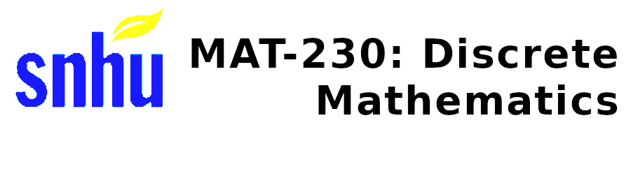

> "Discrete mathematics is the study of mathematical structures that are fundamentally discrete rather than continuous. That is, in contrast to the real numbers that vary continuously, the objects of study in discrete mathematics take on distinct, separated values. Topics include operations on sets, logic, truth tables, counting, relations and digraphs, functions, trees and graph theory. A significant goal of this course is to improve students' critical-thinking and problem-solving skills." ---[MAT-230 Syllabus](./Syllabus.pdf)

This course is a "melting pot" of logical reasoning, number theory, probability and statistics, graphs, counting methods, cryptology, and other topics involving discrete constructs in maths. Discrete maths can be looked at as an introduction to theoretical computer science: as modern computers that are constructed after a [universal Turing Machine](https://en.wikipedia.org/wiki/Turing_machine) deals almost exclusively with software expressedin terms of formal, discrete constructs.

## Assignments

__Note that__ for a lot of the problem sets, I do not want to publish them because of potential issues regarding copyright and non-disclosure. Nonetheless, I did release my submissions for the midterms and final exams. I also released the grades (both letter grades and points achieved) for each assignment that I submitted.

### Examinations

* __Midterm Exam:__ [Module4_Exam_One.pdf](./exams/Module4_Exam_One.pdf)
* __Finals Exam:__ [Module7_Exam_Two.pdf](./exams/Module7_Exam_Two.pdf)

### Grades

| __Grade Item__ | __Points__ | __Grade__ | 
| -------------- | -----------| ----------|
| __1-1__ Discussion: Introduction | 30 / 30 | A | 
| __1-3__ Participation Activities | 20 / 20 | A |
| __1-4__ Challenge Activities | 25 / 25 | A |
| __1-5__ Problem Set | 45.5 / 50 | A- |
| __2-1__ Participation Activities | 20 / 20 | A |
| __2-2__ Challenge Activities | 25 / 25 | A |
| __2-3__ Problem Set | 40.13 / 50 | B- |
| __3-1__ Discussion: Proofs | 30 / 30 | A |
| __3-2__ Participation Activities | 20 / 20 | A |
| __3-3__ Challenge Activities | 25 / 25 | A |
| __3-4__ Problem Set | 24 / 50 | F |
| __4-1__ Participation Activities | 20 / 20 | A |
| __4-2__ Challenge Activities | 25 / 25 | A |
| [__4-3__ Submit Exam One](./exams/Module4_Exam_One.pdf) | 97.5 / 150 | D |
| __5-1__ Participation Activities | 20 / 20 | A |
| __5-2__ Challenge Activities | 25 / 25 | A |
| __5-3__ Problem Set | 40.63 / 50 | B- |
| __6-1__ Participation Activities | 20 / 20 | A |
| __6-2__ Challenge Activities | 25 / 25 | A |
| __6-3__ Problem Set | 44.38 / 50 | B+ |
| __7-1__ Participation Activities | 20 / 20 | A |
| __7-2__ Challenge Activities | 25 / 25 | A |
| [__7-3__ Submit Exam Two](./exams/Module7_Exam_Two.pdf) | 116.25 / 150 | C+ |
| __8-1__ Discussion Cryptography | 30 / 30 | A |
| __8-2__ Participation Activities | 20 / 20 | A |
| __8-3__ Challenge Activities | 25 / 25 | A |

