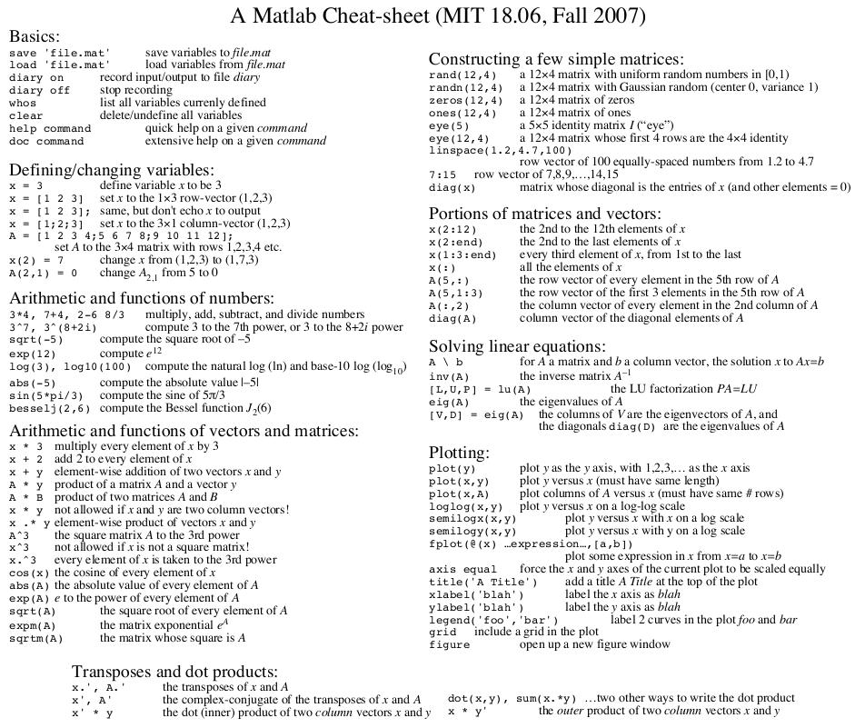

## Introduction

* Course Syllabus: [syllabus.pdf](./img/syllabus.pdf)

## Projects

These projects are the midterm (project 1) and the finals (project 2) in where I apply linear algebra to hypothetical, and realistic, problems in computer science and network engineering:

* [Project 1: Matrix Theory Applied to Computer Network Engineering](./projects/1)
* [Project 2: Application of Lower-Rank Approximation to Image Compression](./projects/2)

## Coursework (by module)

The "official" course textbook is a _zyBooks_ eTextbook entitled _MAT-350: Linear Algebra_ for the Jul.--Aug. 2026 semester at Southern New Hampshire University. The course was eight (8) weeks long, divided into eight (8) modules. Here, I list the topics covered, along with the course labs which involve me writing the MATLAB source code. 

### Module 1: System of Linear Equations

__Topics covered:__ (§1.1) Systems of linear equations, (§1.2) Matrices and linear systems, (§1.4) Elementary row operations, (§1.5) Echelon forms of a matrix, (§1.7) Solution set of a system of linear equations, (§1.9) Gaussian Elimination, (§1.10) Gauss-Jordan elimination, (§1.11) Application to Matrices in Chemistry, (§1.12) Application to Electric circuits.

MATLAB Programming Labs

* [lab_1.3.m](./labs/mod1/lab_1.3.m): On defining matricies, working out their dimensions, the identity matrix via ``eye(Matrix)``, and the matrix transpose
* [lab_1.6.m](./labs/mod1/lab_1.6.m): Row reduction echelon form via ``rref(Matrix)``, and expressing the ``rref(Matrix)`` in terms of its elements as ratios via ``format rat``.
* [lab_1.8.m](./labs/mod1/lab_1.8.m): Augmented matricies, and the arithmetic solution to the number of free variables in an ``rref(Matrix)`` solution.

### Module 2: Matrix Algebra

__Topics covered:__ (§2.1) Matrix addition and scalar multiplication, (§2.2) Matrix multiplication, (§2.4) Matrix equations and linear systems, (§2.5) Inverse of a matrix, (§2.7) Solving a system using an inverse matrix, (§2.9) Elementary matrices, (§2.10) Block matrices, (§2.11) LU Decomposition, (§2.13) Application to Markov Chains.

MATLAB Programming Labs

* [lab_2.3.m](./labs/mod2/lab_2.3.m): Scalar Product, Matrix Multiplication, and More Identity Matricies and Transpose Matricies in the context of Matrix Arithmetic.
* [lab_2.6.m](./labs/mod2/lab_2.6.m): Matrix operations involving the identity matrix, and more inverted matricies.
* [lab_2.8.m](./labs/mod2/lab_2.8.m): Solution to a system of equations with matrix arithmetic.
* [lab_2.12.m](./labs/mod2/lab_2.12.m): Lower triangular matrix and Upper triangular matrix decomposition via the ``lu(Matrix)`` function, and a solution to a system of equations with the LU-decomposition method.

### Module 3: Vectors and Determinants

__Topics covered:__ (§3.1) Introduction to Vectors, (§3.2) Vector operations, (§3.3) Dot product, (§3.5) Cross product, (§3.7) Applications to 3D coordinate geometry, (§3.8) Applications of vectors to physics, (§3.9) Introduction to determinants, (§3.11) Cofactor expansions, (§3.12) Applications to calculating Area and Volume, (§3.13) Properties of determinants, (§3.14) Invertibility and determinants, (§3.15) Cramer's rule, (§3.17) Permutations and determinants. 

MATLAB Programming Labs

* [lab_3.4.m](./labs/mod3/lab_3.4.m): On the Dot Product, and working with it via transpose matricies.
* [lab_3.6.m](./labs/mod3/lab_3.6.m): On the Cross Product, and the volume of a parallelepiped.
* [lab_3.10.m](./labs/mod3/lab_3.10.m): Calculating the determinant of the matrix via the ``det(Matrix)`` function.
* [lab_3.16.m](./labs/mod3/lab_3.16.m): On Cramer's Rule, "slicing" matricies and replacing one column with another, and applications of the ``det(Matrix)`` function to solve the system via Cramer's rule.

### Module 4: Vector Spaces

__Topics covered:__ (§4.1) Vector spaces and subspaces, (§4.2) Spanning sets, (§4.4) Linear independence and dependence, (§4.5) Basis and dimension, (§4.7) General vector spaces, (§4.8) Subspaces, (§4.9) Coordinatization, (§4.11) Four fundamental subspaces, (§4.12) Rank and nullity.

MATLAB Programming Labs

* [lab_4.3.m](./labs/mod4/lab_4.3.m): On the span of a matrix, construction a matrix from vectors, and working out its pivot columns with ``rref(Matrix)`` (along with an example with an augmented matrix).
* [lab_4.6.m](./labs/mod4/lab_4.6.m): On the basis of a matrix: like with the previous lab, creating a matrix from vectors, and computing its basis matrix by augmenting the matrix and ``eye(dimensions of given matrix)``, reducing the ``[Matrix | eye(dims)]`` into its row echelon form, and finally constructing a basis matrix with the inverse of the the first two vectors, and those vectors respective columns from the identity matrix computed by ``eye(dimensions of given matrix)``
* [lab_4.10.m](./labs/mod4/lab_4.10.m): On changing the coordinates of a matrix: doing so by augmenting matrix B and C as ``[C B]``, reducing the augmented matrix to row echelon form via ``rref([C B])``, and then working out the change of coordinates with the appropriate columns from the ``rref([C B])`` matrix. 
* [lab_4.13.m](./labs/mod4/lab_4.13.m): On the rank and null of a matrix via the ``rank()`` and ``null()`` functions. 

### Module 5: Linear Transformations

__Topics covered:__ (§5.1) Linear transformations between Euclidean spaces, (§5.3) General linear transformations, (§5.4) Isomorphisms, (§5.5) Rank and nullity of a linear transformation, (§5.6) Composition of linear transformations, (§5.7) Change of bases and matrices of linear transformations, (§5.9) Applications of transformations to 2D coordinate geometry.

MATLAB Programming Labs

* [lab_5.2.m](./labs/mod5/lab_5.2.m): On linear transformations by rotating a standard matrix 60-degrees counterclockwise, and multiplying said rotated matrix by another matrix containing its triangular coordinates represented by the columns. A plot of the triangular coordinates are plotted against their respective transforms with the built-in ``plot()`` function.
* [lab_5.8.m](./labs/mod5/lab_5.8.m): On the changing of basis: procedure involves augmenting matrix ``C`` and matrix ``B``, and then performing a row reduction to echelon form where the cells are to be formatted as ratios. Relevant cells in its transform is later displayed.

### Module 6: Eigenvalues and Eigenvectors

__Topics covered:__ (§6.1) Eigenvalues and Eigenvectors, (§6.3) Eigenspaces, (§6.4) Similarity and diagonalization, (§6.6) Complex eigenvalues and eigenvectors, (§6.7) Applications to Inertia tensors.

MATLAB Programming Labs

* [lab_6.2.m](./labs/mod6/lab_6.2.m): Demonstration of Eigenvalue and Eigenvector problems: the identification of eigenvalues of a matrix with the built-in ``poly(Matrix)`` command, the identification of eigenvalues of a matrix with the built-in ``roots(Matrix)`` command, and finally the construction of an eigenvector matrix with the built-in ``eig(eigenvalues)`` command. 
* [lab_6.5.m](./labs/mod6/lab_6.5.m): On diagonalization: its demonstration by the use of the ``eig(Matrix)`` to find a matrix that diagonalizes the input matrix, and another matrix that is the resulting diagonal. 

### Module 7: Inner Product Spaces

__Topics covered:__ (§7.1) Inner product spaces, (§7.2) Norms and distances, (§7.4) Orthogonal bases, (§7.5) Orthogonal complements, (§7.6) Orthogonal matrices, (§7.8) Singular Value Decomposition, or "SVD."

MATLAB Programming Labs

* [lab_7.3.m](./labs/mod7/lab_7.3.m): On norms and distances: the application of the built-in ``norm()`` function to work out the 2-norm distance between the difference of two vectors: ``norm(u - v, 2)``, and the application  of the very same ``norm()`` function to find the Frobenius norm of two matrices: ``norm(A - B, 'fro')``.
* [lab_7.7.m](./labs/mod7/lab_7.7.m): On QR factorization: the application of the ``qr(B)`` to run a QR-factorization of an arbitrary matrix, and checking it by multiplying the resulting orthogonal matrix by the resulting upper triangular matrix.
* [lab_7.9.m](./labs/mod7/lab_7.9.m): On the Singular Value Decomposition: the use of the ``svd()`` function to work out the singular value decomposition of an arbitrary matrix, and checking the results by computing the ``U*S*V.'``, which is the product of the three components of an SVD, with the latter ``n × n`` SVD matrix being transposed, of course. 

### Module 8: Additional Topics

[todo]

## Resources

### On the Application of Linear Algebra

In the last module in the class, the students (s.a. myself) were asked to respond to a prompt discussing applications of linear algebra. We were also asked to include at least one bit of literature or online resource showing, or just introducing, an application of linear algebra to "real world" problems. Here are those literature items and resources shared by myself and others:

* Al-Nafjan, A., Alrashoudi, N., & Alrasheed, H. (2022). Recommendation System Algorithms on Location-Based Social Networks: Comparative Study. _Information, 13(4)_, 188. https://doi.org/10.3390/info13040188
* Brin, S., & Page, L. (1998). The anatomy of a large-scale hypertextual Web search engine. _Computer Networks and ISDN Systems, 30(1–7)_, 107–117. https://doi.org/10.1016/S0169-7552(98)00110-X
* Bryan, K., & Leise, T. (2006). The $25,000,000,000 eigenvector: The linear algebra behind Google. _SIAM Review, 48(3)_, 569–581. https://doi.org/10.1137/050623280
* Gambetta, G (2021). _Computer Graphics from Scratch: A Programmer's Introduction to 3D Rendering_. No Starch Press. https://nostarch.com/computer-graphics-scratch
* Gupta, A., & Mandal, S. (2024). Linear algebra and Galois theory. arXiv. https://doi.org/10.48550/arXiv.2405.18121
* Hassencahl, F. J. (1970). _HARRY H. LAUGHLIN, 'EXPERT EUGENICS AGENT' FOR THE HOUSE COMMITTEE ON IMMIGRATION AND NATURALIZATION, 1921 TO 1931_. Case Western Reserve University ProQuest Dissertations & Theses. https://www.proquest.com/docview/302467912
* "Himasharandil" (Jul 9, 2025). _Matrix factorization techniques_. Medium. Retrieved on Aug. 24, 2026 from: https://medium.com/@himasharandil/matrix-factorization-techniques-ab01539c2906
* Joshi, Sagar. Application of linear algebra in image processing for Medical Electronics. _Communications on Applied Nonlinear Analysis, vol. 32, no. 1_, 15 Sept. 2024, pp. 239–253, https://doi.org/10.52783/cana.v32.1634
* Jovanovic, D. (2025, June 12). _Understanding matrices in supply chain • log-hub. Log_. Retrieved c.a. Aug. 20, 2026 from: https://log-hub.com/understanding-matrices-in-supply-chain/
* Koren, Y., Bell, R., & Volinsky, C. (2009). Matrix factorization techniques for recommender systems. _Computer, 42(8)_, 30–37. https://doi.org/10.1109/MC.2009.263
* Kun, J. (2015). _Here's just a fraction of what you can do with linear algebra_. Medium. https://medium.com/@jeremyjkun/here-s-just-a-fraction-of-what-you-can-do-with-linear-algebra-633383d4153f
* Laughlin, H. H. (1935). The Probability-Resultant. _Proceedings of the National Academy of Sciences, 21(11)_, 601–610. https://doi.org/10.1073/pnas.21.11.601
* Laughlin, H. H. (1934). Racing Capacity in the Thoroughbred Horse, Part II. _The Scientific Monthly_, https://www.jstor.org/stable/15575
* Laughlin, H. H. (1933). The General Formula of Heredity. _Proceedings of the National Academy of Science, Vol. 19, No. 8_. https://doi.org/10.1073/pnas.19.8.787
* Lee, F. (n.d.) _What is linear algebra for machine learning?_ IBM Think. Retrieved on Aug. 24, 2026 from: https://www.ibm.com/think/topics/linear-algebra-for-machine-learning
* Lysa Antero. (2023). Applications of Eigenvectors in Mathematics and Computer Science. _Mathematica Eterna, 13(4)_, 1–2. https://doi.org/10.35248/1314-3344.23.13.202
    * Note that I could not find this paper in the literature, it was a citation given by a classmate, and I figured that I would list it here for documentation purposes. 
* National Coordination Office for Space-Based Positioning, Navigation, and Timing. GPS. https://www.gps.gov/
* Quantum Flagship. (n.d.). _How your smartphone uses Quantum Mechanics_. Retrieved c.a. Aug. 2020, 2026 from: https://qt.eu/applications/how-your-smartphone-uses-quantum-mechanics
* Rasuli, B., & Moore, C. (2019). _Linear algebra_. Radiopaedia.Org. https://doi.org/10.53347/rid-69563
* Rosen, D. (Jul. 1, 2009). _Linear algebra for game developers ~ part 1_. Wolfire Games. Retrieved on Aug. 24, 2026 from: https://www.wolfire.com/blog/2009/07/linear-algebra-for-game-developers-part-1/
* Salman, A. E. _H. H. Laughlin: American Scientist, American Progressive, Nazi Collaborator_. https://eugenicsanthology.com/home/hhlaughlin/
* Silver, D. S. (2006). The Secret History of Mathematicians. _The American Scientist. Vol. 94. No. 6_. https://10.1511/2006.62.556
* Singh, R. Milan (2026). Mathematical concepts of linear algebra in AI tools: a calculation-based study. Journal of Hyperstructures, 15(1), 172-180. https://doi.org/10.22098/jhs.2024.15660.1038
* Strang, G. (n.d.). _Left and right inverses: Pseudoinverse [Video]_. Massachusetts Institute of Technology OpenCourseWare. https://ocw.mit.edu/courses/18-06-linear-algebra-spring-2010/resources/lecture-33-left-and-right-inverses-pseudoinverse/
* Thomas, M. & Tereshchuk, Y. (Dec. 6, 2015). _Where would you use matrix algebra?_ Wordpress Blog. Retrieved on Aug. 24, 2026 from: https://mathsmartinthomas.wordpress.com/2015/12/06/where-would-you-use-matrix-algebra/
* Tonsfeuerborn, M., von Nitzsch, R., & Siebert, J. U. (2026). Linear transformation of one-dimensional utility functions: Empirical study on the impact on the final ranking of alternatives in personal decisions. _Decision Analysis, 23(1)_, 46–64. https://doi.org/10.1287/deca.2024.0317

### MATLAB Reference Sheet

