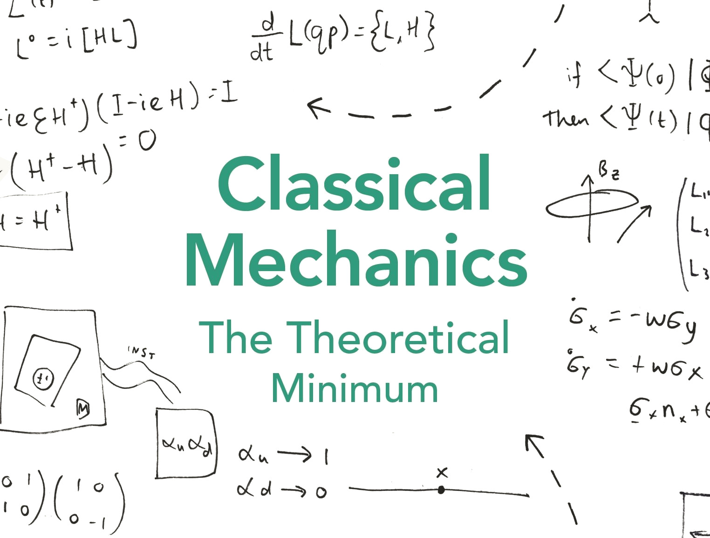

\([Banner Image: Amazon.com](https://www.amazon.com/Classical-Mechanics-Theoretical-George-Hrabovsky/dp/0141976225)\)

This is the obligatory "intro to physics" class that I took. It covered the usual stuff like _kinematics,_ _dynamics,_ _Newton's laws,_ _energy and momentum,_ and applied physics. The following are the submissions, notes and everything else for the course.

### Physics labs

* [Lab 2-1: Kinematics](./labs/2-1/)
* [Lab 4-2: Newton's Second Law](./labs/4-2/)
* [Lab 7-1: Momentum](./labs/7-1/)

__Update: 15 Jul., 2025:__ I found a resource from the _University of Vermont_ that hosts their own version of the manuals from the producers of the Physics lab kit: https://www.uvm.edu/~ldonfort/P21S20/

### Projects

* [Project 3-2: A hypothetical supply drop mission](./papers/3-1/)
* [Project 5-2: Assessment of cell phone case durability](./papers/5-1/)
* [Project 7-2: A design and analysis of a new roller coaster](./papers/7-2/)
* [Project 8-1: Perception of Physics](./papers/8-1/)

