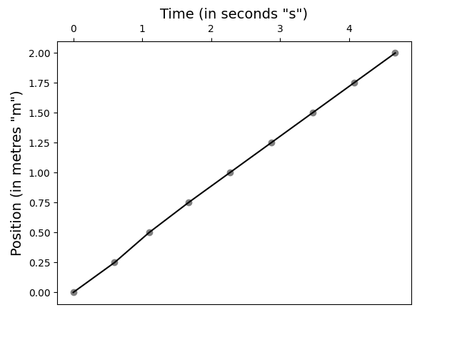
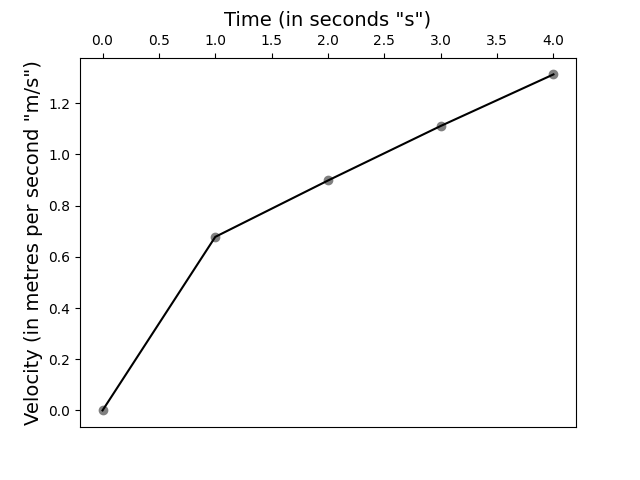

## Lab 2-1: Kinematics

This was the first lab that I did. It consisted of five (5) activities, which are:

1. The graphing and interpretation of a given data table.
2. The measurement and data analysis of a toy car.
3. A replication of Galileo's classical ramp kinematics experiment.
4. "Extending" from Activity 3, a scientific analysis of the ramp experiment.
5. "Extending" from Activities 3 and 4, a demonstration that acceleration is constant.

You may read the lab report [here](./2-1.pdf). The following discusses the technical procedure to make my charts and work out calculations that have not been done by hand, or to discuss things that have I did not have a chance to discuss in the paper. For those interested in doing the lab for themselves, you may consult the [Lab Manual](./Kinematics_Lab.pdf).

### Activity 1

This task just tested the student's ability to make a line chart from a given table. In this case, we are given the following table for a locomotive and its displacement given the time elapsed:

|__Time (t) in seconds__|__Position p(t) in metres__|
|-----------------------|---------------------------|
|0|0|
|5|20|
|10|40|
|15|50|
|20|55|
|30|60|
|35|70|
|40|70|
|45|70|
|50|55|

My method for creating line charts is to use the Python programming language, and the ``csv``, ``pandas`` and ``matplotlib`` modules to create the line chart. I came up with the following basic skeleton for creating line graphs:

```python
import csv
import pandas as pd
import matplotlib.pyplot as plt

fig, ax = plt.subplots()

table = pd.read_csv("{table}")

plt.scatter(table["{abscissa}"], table["{ordinate}"], color="grey")
plt.plot(table["{abscissa}"], table["{ordinate}"], color="black")

plt.title("{abscissa label}", fontsize=14)
plt.ylabel("{ordinate label})", fontsize=14)

ax.xaxis.tick_top()
plt.show()
```

Throughout this course, all the code that I used to make line graphs--- or any charts for that matter--- are some variation of the above script. The following is the output:


The code that I used to create this graph is [Activity1.py](./code/Activity1.py).

### Activity 2

Here, I finally got to do some analysis on real data. I was given a battery-powered electronic toy car to test kinematic theories of displacement. The lab gave displacement values (measured in metres) and I had "fill in" the time (in seconds) that the toy car was able to make a displacement. The table below shows my results:

| __Time (s)__ | __Displacement (m)*__ |
|--------------|-----------------------|
|``0.00``|0.00|
|``0.60``|0.25|
|``1.10``|0.50|
|``1.67``|0.75|
|``2.27``|1.00|
|``2.87``|1.25|
|``3.47``|1.50|
|``4.07``|1.75|
|``4.67``|2.00|

My data entries into the table are indicated by generic highlighting for computer code. The following graph \([Activity2-1.py](./code/Activity2-1.py)\) is used to compare the displacement of the toy car (in seconds) to its position traveled (in metres):



I also took note of the velocity of the toy car as time passed by. The following are my recorded results:

| __Time (s)__ | __Velocity (m/s)*__ |
|--------------|---------------------|
|0|``0.00000``|
|1|``0.67790``|
|2|``0.89815``|
|3|``1.11123``|
|4|``1.31265``|

As with the first table, I indicated my entries with a generic highlighting used with computer code. The following graph \([Activity2-2.py](./code/Activity2-2.py)\) shows the time elapsed plotted against the toy car's velocity:



### Activity 3

As with the previous activities, I created two charts \([Figure_4.png](./figures/Figure_4.png), [Figure_5.png](./figures/Figure_5.png)\) with the [Activity3-1.py](./code/Activity3-1.py) and [Activity3-2.py](./code/Activity3-1.py) Python scripts--- respectively.

### Activity 4

I attempted to do this experiment, but got error margins that were beyond the expected value and the results cannot be made sense of.

### Activity 5

As with the previous experiment, the experimental apparatus did not seem to produce any results that can be interpreted in a meaningful way.

## Erratas

* Obviously, with regards to activities 4 and 5, I experienced technical errors that prevented me from testing certain kinematics theories.

