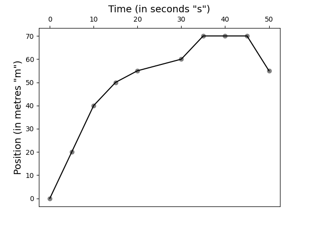

## Lab 2-1: Kinematics

This was the first lab that I did. It consisted of five (5) activities, which are:

1. The graphing and interpretation of a given data table.
2. The measurement and data analysis of a toy car.
3. A replication of Galileo's classical ramp kinematics experiment.
4. "Extending" from Activity 3, a scientific analysis of the ramp experiment.
5. "Extending" from Activities 3 and 4, a demonstration that acceleration is constant.

### Activity 1

This task just tested the student's ability to make a line chart from a given table. In this case, we are given the following table for a locomotive and its displacement given the time elapsed:

|__Time (t) in seconds__|__Position p(t) in metres__|
|-----------------------|---------------------------|
|0|0|
|5|20|
|10|40|
|15|50|
|20|55|
|30|60|
|35|70|
|40|70|
|45|70|
|50|55|

My method for creating line charts is to use the Python programming language, and the ``csv``, ``pandas`` and ``matplotlib`` modules to create the line chart. I came up with the following basic skeleton for creating line graphs:

```python
import csv
import pandas as pd
import matplotlib.pyplot as plt

fig, ax = plt.subplots()

table = pd.read_csv("{table}")

plt.scatter(table["{abscissa}"], table["{ordinate}"], color="grey")
plt.plot(table["{abscissa}"], table["{ordinate}"], color="black")

plt.title("{abscissa label}", fontsize=14)
plt.ylabel("{ordinate label})", fontsize=14)

ax.xaxis.tick_top()
plt.show()
```

Throughout this course, all the code that I used to make line graphs--- or any charts for that matter--- are some variation of the above script. The following is the output:

<center>
  
</center>

The code that I used to create this table is [Activity1.py](./code/Activity1.py).

### Activity 2

Here, I finally got to do some analysis on real data. I was given a battery-powered electronic toy car to test kinematic theories of displacement. The lab gave displacement values (measured in metres) and I had "fill in" the time (in seconds) that the toy car was able to make a displacement. The table below shows my results:

|__Time (s)__|__Displacement (m)*__|
|------------|---------------------|
|_0.00_|0.00|
|_0.60_|0.25|
|_1.10_|0.50|
|_1.67_|0.75|
|_2.27_|1.00|
|_2.87_|1.25|
|_3.47_|1.50|
|_4.07_|1.75|
|_4.67_|2.00|

My data entries into the table are indicated by italics. 

### Activity 3

### Activity 4

I attempted to do this experiment, but got error margins that were beyond the expected value.

### Activity 5

As with the previous experiment, the experimental apparatus did not seem to produce any results that can be interpreted in a meaningful way.

