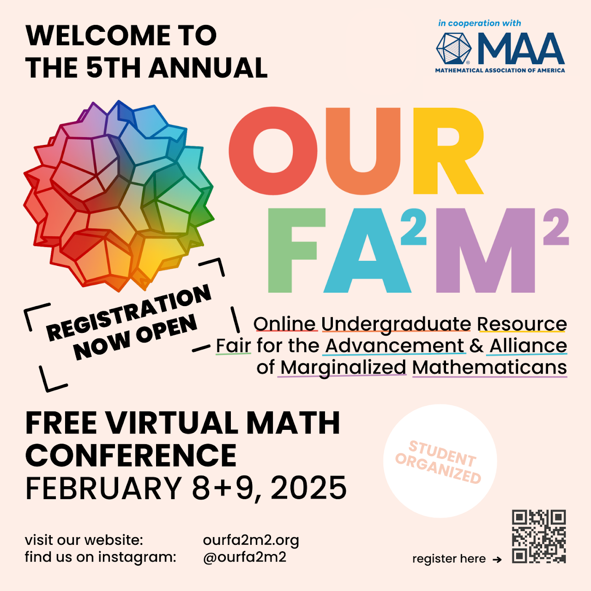

On the 8th and 9th of February 2025, I attended the <a href="https://www.ourfa2m2.org/" target="_blank">OURFA2M2</a> virtual, and free, mathematics conference, which discusses maths from a "lefty" perspective. I attended them _as a viewer, not as a speaker_, and these are just some interesting takeaways from what I learnt from their seminars.

## Seminars that I attended

### Day 1

Our Stories: Makayla Cowles

Nothing to see here ... for now ;-)

Crash Course: Ethics of Mathematics (not recorded)

This one was very fun to watch to and interact with. The following are resources regarding the seminar:

* Matthew Cordes (the speaker)'s webpage: https://www.mcordes.com/
    * Cordes' _Ethics in Mathematics_ course syllabus: https://www.mcordes.com/F23_ethics_syllabus.pdf
* [Article]: Press, E. (Nov. 13, 2023). _Does A.I. Lead Police to Ignore Contradictory Evidence? Too often, a facial-recognition search represents virtually the entirety of a police investigation_. The New Yorker. https://www.newyorker.com/magazine/2023/11/20/does-a-i-lead-police-to-ignore-contradictory-evidence
* Article: Kollewe, J. (Feb. 5, 2025). _Google owner drops promise not to use AI for weapons: Alphabet guidelines no longer refer to not pursuing technologies that could ‘cause or are likely to cause overall harm’_. The Guardian. https://www.theguardian.com/technology/2025/feb/05/google-owner-drops-promise-not-to-use-ai-for-weapons
* Just Mathematics Collective: https://www.justmathematicscollective.net/
    * Amerzaine, R. and "Root Beer" (Jul. 13, 2022). _No cops in the lecture hall: cheating and what (not) to do about it_. Just Mathematics Collective. Retrieved on Feb. 9, 2025 from: https://www.justmathematicscollective.net/cheating.pdf
* Presentation: The Moral Character of Cryptographic Work (Rogaway, c.a. 2015). Retrieved on Feb. 9, 2025 from: https://web.cs.ucdavis.edu/~rogaway/papers/ac15.pdf
* [Oswald Teichmüller](https://en.wikipedia.org/wiki/Oswald_Teichm%C3%BCller), a Nazi mathematician, was mentioned when arguing whether-or-not to give Nazis credence through academic achievements. 
* Book: Joseph, N. M, Haynes, C. & Cobb, F. (2016). _Interrogating Whiteness and Relinquishing Power: White Faculty’s Commitment to Racial Consciousness in STEM Classrooms_. Retrieved on Feb. 9, 2025 from: https://api.pageplace.de/preview/DT0400.9781453917169_A45242720/preview-9781453917169_A45242720.pdf
* Faulkner, W. (2000). Dualisms, Hierarchies and Gender in Engineering. _In Social Studies of Science 30/5(October 2000) pp. 759–92_. Retrieved on Feb. 9, 2025 from: https://www.homepages.ucl.ac.uk/~ucessjb/Faulkner%202000.pdf
* Leyva, Luis & McNeill, Taylor & Duran, Antonio. (2022). A Queer of Color Challenge to Neutrality in Undergraduate STEM Pedagogy as a White, Cisheteropatriarchal Space. Journal of Women and Minorities in Science and Engineering. 28. 79-94. [10.1615/JWomenMinorScienEng.2022036586](https://dx.doi.org/10.1615/JWomenMinorScienEng.2022036586).
    * Paper's ResearchGate entry: https://www.researchgate.net/publication/358195879_A_Queer_of_Color_Challenge_to_Neutrality_in_Undergraduate_STEM_Pedagogy_as_a_White_Cisheteropatriarchal_Space/citation/download
* Shulman, B. (????). _Is There Enough Poison Gas to Kill the City?: The Teaching of Ethics in Mathematics Classes_. The Mathematical Association of America. Retrieved on Feb. 9, 2025 from: https://perso.univ-rennes1.fr/matthieu.romagny/ethique/ressources/Shulman_Is_there_enough_poison_gas_to_kill_the_city_the_teaching_of_ethics_in_mathematics_classes.pdf
* European Mathematical Society's Code of Ethics: https://euromathsoc.org/code-of-ethics

### Day 2

Our Stories: Claudio Gomez-Gonzales (not recorded)

* Article: Hosking, T. (Dec. 20, 2017). _The Changing Landscape of Student Protest in Higher Education_. The Atlantic. https://www.theatlantic.com/education/archive/2017/12/the-changing-landscape-of-student-protest-in-higher-education/548867/
* Webinar discussing defending agaisnt neoliberalism attacks against higher education: https://us06web.zoom.us/webinar/register/WN_HagciciXTIW_BulEdrQRCA#/registration

Crash Course: Vistas of Mathematical Illustration

* Elliot Kienzle (the speakers)'s webpage: https://chessapig.github.io/
* "Railroad Repair" maths puzzle game: https://archive.org/details/decimals#
* Creative Mathematics Resources:
    * Wikipedia Introduction: https://en.wikipedia.org/wiki/Creative_coding
    * OpenProcessing Community: https://openprocessing.org/
    * ``p5.js`` JavaScript library for creative coding: https://p5js.org/
    * _The Coding Train_ YouTube channel: https://www.youtube.com/channel/UCvjgXvBlbQiydffZU7m1_aw
* Geoemtry Labs United: Offshoots of the original NSF-backed "Geometry Lab": https://geometrylabs.net/labs/
* Math to Touch: https://imaginary.github.io/applauncher2/
* Joint Mathematics Meeting: https://jointmathematicsmeetings.org/jmm
    * They Have a Discord - TODO: find out where it is.
* Illustrating Mathematics Seminar: https://illustratingmath.org/

Keynote: Math in Drag

* Speaker's Homepage: https://www.onlinekyne.com/
    * Speaker's Substack: https://onlinekyne.substack.com/
    * National Museum of Mathematics: Math Encounters: https://momath.org/math-encounters/

Our Stories: Fatima Akinola

* Association for Women in Mathematics: https://awm-math.org/

Crash Course: Evolutionary Dynamics

* Speaker: Benjamin Allen.
* Evolution can be applied to both biology and culture.
* Populations Evolve.
* Mechanisms of evolution:
    * [TODO] - try to find slide
* Article: A most cooperative network (Benjamin Allenn, 2017): https://communities.springernature.com/posts/a-most-cooperative-network
* Article: Global cooperation depends on the strength of local connections (Benjamin Allen, ????) https://aeon.co/ideas/global-cooperation-depends-on-the-strength-of-local-connections
* https://www.nature.com/articles/s41559-019-1019-7

## Other Seminars

Crash Course: An Introduction to Applied Topology

I only briefly attended this seminar, not all the way to the end, but I figured that I'd share the links that they shared while there:

* The slides to this presentation: https://people.clas.ufl.edu/henry-adams/files/AnIntroductionToAppliedTopology_Slides_ReducedSize.pdf
* Applied Algebraic Topology Research Network: https://www.aatrn.net/
    * Their YouTube channel (I think?): https://www.youtube.com/@aatrn

