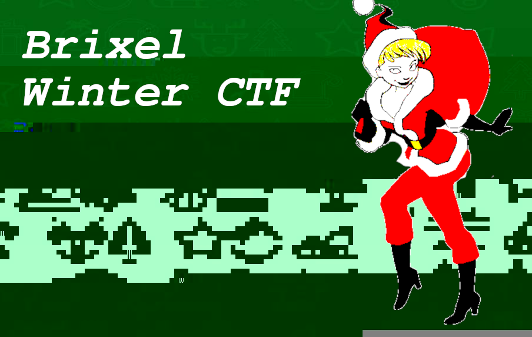
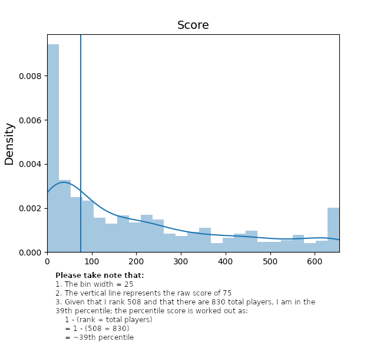

## Brixel winter capture the flag (2020 ed.).

This was a Christmasy capture-the-flag where we had 59 tasks that could be organised into eight different categories. I didnt finish all of them, but figured that I could do a writeup and post them on GitHub nonetheless.

### Challenges

| | __Challenge name__ | __Category__ | __Flag found?__ |
|-| ------------------ | ------------ | --------------- |
|1.| [Browsercheck](./challenges/internet/Browsercheck/README.md) | Internet | Yes |
|2.| [Dadjokes](./challenges/internet/Dadjokes/README.md) | Internet | No |
|3.| [Discord](./challenges/internet/Discord/README.md) | Internet | Yes |
|4.| [Easy](./challenges/internet/Easy/README.md) | Internet | Yes |
|5.| [readme](./challenges/internet/readme/README.md) | Internet | Yes |
|6.| [A quick search](./challenges/osint/A%20quick%20search/README.md) | OSINT | Yes |
|7.| [Manhunt 1](./challenges/osint/Manhunt1/README.md) | OSINT | Yes |
|8.| [Manhunt 2](./challenges/osint/Manhunt2/README.md) | OSINT | Yes |
|9.| [Manhunt 3](./challenges/osint/Manhunt3/README.md) | OSINT | No |
|10.| [Are you fast enough](./challenges/programming/Are%20you%20fast%20enough/README.md) | Programming | Yes |
|11.| [Keep walking](./challenges/programming/Keep%20walking/README.md) | Programming | Yes |

### Statistics

I ranked in the 39th percentile and created a kde plot with a Python script ([here](./statistics/dist.py)) to visualise my place in this contest.

* Brixel winter ctf scoreboard: [https://archive.is/hXOk1](https://archive.is/hXOk1)
* My team profile statistics: [https://archive.is/nS1xl](https://archive.is/nS1xl)
