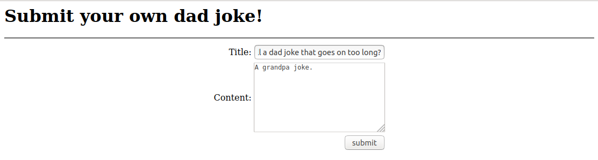

# Dadjokes

```
Darn! Some idiot scriptkiddy broke my favorite website full of dad jokes!

I can't seem to contact the owner to fix the site

Can you bring it back and remove the defaced page?

http://timesink.be/dadjokes/ 
```

Okay, I was thinking of Twitter users @c0nc0rdance and @rasmansa when doing this lol.

So first thing I did was open up the link and loom at the page sauce, and found this delicious comment burried in the HTML:

``<!-- Hey bozo! I left your original index file under index_backup.html so you can see how your site looked before I used my l33t skillz to deface it. -->``

So I went to ``http://timesink.be/dadjokes/index_backup.html`` and found a form where to "submit" dad jokes: ``http://timesink.be/dadjokes/jokes/submit.php``

I then probed the form a bit with dad jokes that I stole from @rasmansa:



... and then I couldn't find the time to solve this :-(
