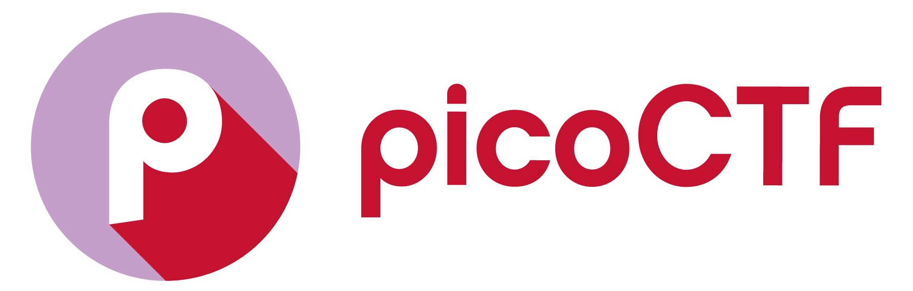
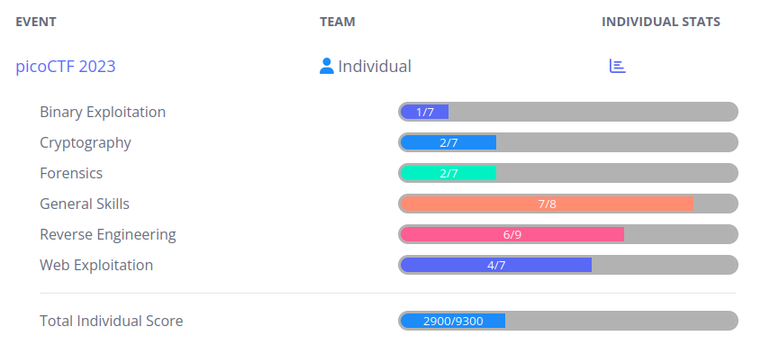

This is GitHub repository that showcases the work that I did for [picoCTF](https://picoctf.org/) 2023 edition.

## Writeups

* "Aleksey" (2023). [picoCTF writeup: Decompilation of a simple Android Package](https://mobileappcircular.com/picoctf-writeup-decompilation-of-a-simple-android-package-57608b7c5929). Mobile App Circular.
    * This writeup deals with the following picoCTF 2023 challenges: [timer](./sol/timer).

## Challenges

Solved: these are challenges where I worked out the flag

* [chrono](./sol/chrono)
* [findme](./sol/findme)
* [hideme](./sol/hideme)
* [MatchTheRegex](./sol/MatchTheRegex)
* [money-ware](./sol/money-ware)
* [More SQLi](./sol/More%20SQLi)
* [Permissions](./sol/Permissions)
* [ReadMyCert](./sol/ReadMyCert)
* [Ready Gladiator 0](./sol/Ready%20Gladiator%200)
* [Ready Gladiator 1](./sol/Ready%20Gladiator%201)
* [Ready Gladiator 2](./sol/Ready%20Gladiator%202)
* [repetitions](./sol/repetitions)
* [Reverse](./sol/Reverse)
* [rotation](./sol/rotation)
* [Rules 2023](./sol/Rules%202023)
* [Safe Opener 2](./sol/Safe%20Opener%202)
* [SOAP](./sol/SOAP)
* [Special](./sol/Special)
* [timer](./sol/timer)
* [two-sum](./sol/two-sum)
* [useless](./sol/useless)
* [who is it](./sol/who%20is%20it)

Unsolved: these are challenges that I started, but could not derive a flag

* [babygame01](./usol/babygame01)
* [HideToSee](./usol/HideToSee)
* [Java Code Analysis](./usol/Java%20Code%20Analysis)
* [No way out](./usol/No%20way%20out)
* [PcapPoisoning](./usol/PcapPoisoning)
* [Virtual Machine 0](./usol/Virtual%20Machine%200)

## Rankings

* I rank 1238 out of 6924 in the _Global_ scoreboard.
* I rank 414 out of 2463 in the _Undergraduate Students_ scoreboard.

 

## Further Reading

* _Capture The Flag 101:_ [https://ctf101.org/](https://ctf101.org/)
* _CTF Field Guide:_ [https://trailofbits.github.io/ctf/](https://trailofbits.github.io/ctf/)
* _Fauzi's CTF Playbook:_ [https://fareedfauzi.gitbook.io/ctf-checklist-for-beginner/](https://fareedfauzi.gitbook.io/ctf-checklist-for-beginner/)
* _CTF-Checklist:_ [https://github.com/ZeroDayTea/CTF-Checklist](https://github.com/ZeroDayTea/CTF-Checklist)
* _HackTricks:_ [https://book.hacktricks.xyz/](https://book.hacktricks.xyz/)
* _Hacker 101:_ [https://www.hacker101.com/](https://www.hacker101.com/)
