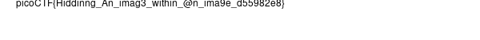

# hideme

Author: Geoffrey Njogu
Location: https://play.picoctf.org/events/72/challenges/challenge/350
Tags: Forensics, Steganography

## Problem

> Every file gets a flag. The SOC analyst saw one image been sent back and forth between two people. They decided to investigate and found out that there was more than what meets the eye [here](https://artifacts.picoctf.net/c/258/flag.png).

This challenge came with a PNG image file called ``flag.png`` ([download it here](./flag.png)).

## Previous attempts

At a cursory glance, this image is just the picoCTF logo (flag.png as Figure 1). But, there may be information hidden in said image. Because this challenge mentions stenography, I first assumed that there was a flag hidden in the PNG file's exif data. I attempted to extract it like so:

```
dna@deniers:~/hideme$ exif flag.png
Corrupt data
The data provided does not follow the specification.
ExifLoader: The data supplied does not seem to contain EXIF data.
dna@deniers:~/hideme$ 
```

I suppose that the flag is not in a nonexistent (or corrupted?) EXIF section. So I proceeded by opening the .png file in a text editor and looking for a ``picoCTF{`` pattern. This quickly showed itself to not be the correct method. I then did some research about steganography with PNG images, and found a tool [1][2]. I tried to use its online tool (Figure 2) to find any hidden information in the PNG image file.

Further in my research, I found an article [3] that discusses some techniques for embedding payloads in PNG images. It made me think about other kinds of tools like ``stegcracker``. However, it is not compatible with ``png`` files:

```
dna@deniers:~/hideme$ stegcracker flag.png ~/Documents/rockyou.txt
StegCracker 2.1.0 - (https://github.com/Paradoxis/StegCracker)
Copyright (c) 2023 - Luke Paris (Paradoxis)

StegCracker has been retired following the release of StegSeek, which 
will blast through the rockyou.txt wordlist within 1.9 second as opposed 
to StegCracker which takes ~5 hours.

StegSeek can be found at: https://github.com/RickdeJager/stegseek

Error: Unsupported file type 'png'! Supported extensions: jpg, jpeg, bmp, wav, au
dna@deniers:~/hideme$ 
```

I'll try using ``stegseek`` against ``flag.png``:

```
dna@deniers:~/hideme$ stegseek --crack flag.png ~/Documents/rockyou.txt
StegSeek 0.6 - https://github.com/RickdeJager/StegSeek

[!] error: the file format of the file "flag.png" is not supported.

dna@deniers:~/hideme$
```

I proceeded to do more research and came across another article [4] discussing a stenography technique where the least significant bit of each byte contains a bit of the message. Further research brought me to a GitHub project [5] that decodes based on this description. I tried to use it with varying levels of -n, like so:

```
dna@deniers:~/Documents/Blogging/Medium/picoCTF/2023/hideme$ stegolsb steglsb -r -i ./flag.png -o steglsb_decode.txt -n 2
This image appears to be corrupted.
It claims to hold 16777215 B, but can only hold 193533 B with 2 LSBs
Usage: stegolsb steglsb [OPTIONS]

  Hides or recovers data in and from an image

Options:
  -h, --hide                      To hide data in an image file

[... snip ...]

dna@deniers:~/hideme$ stegolsb steglsb -r -i ./flag.png -o steglsb_decode.txt
This image appears to be corrupted.
It claims to hold 16777215 B, but can only hold 193533 B with 2 LSBs
Usage: stegolsb steglsb [OPTIONS]

  Hides or recovers data in and from an image

Options:

[... snip ...]

dna@deniers:~/hideme$ stegolsb steglsb -r -i ./flag.png -o steglsb_decode.txt -n 8

```

But it returned nothing. Most of these decoders all reported the same thing: a corrupted PNG file. I did research into "corrupted png files" and found an article discussing ``pngcheck``, which I used to try to repair this PNG. [6] Instead, I just got info on it:

```
dna@deniers:~/hideme$ pngcheck -cvt flag.png
File: flag.png (42937 bytes)
  chunk IHDR at offset 0x0000c, length 13
    512 x 504 image, 32-bit RGB+alpha, non-interlaced
  chunk IDAT at offset 0x00025, length 8192
    zlib: deflated, 32K window, fast compression
  chunk IDAT at offset 0x02031, length 8192
  chunk IDAT at offset 0x0403d, length 8192
  chunk IDAT at offset 0x06049, length 8192
  chunk IDAT at offset 0x08055, length 6866
  chunk IEND at offset 0x09b33, length 0
  additional data after IEND chunk
ERRORS DETECTED in flag.png
dna@deniers:~/hideme$ 
```

I then came across a "CTF checklist" complete with a stenography section [7] and tried some of their methods. I tried to use ``compress-or-die.com`` [8] to fix the PNG image (Figure 4). It was "success[ful]" (Figure 5) and I downloaded it. I then tried to extract its EXIF data again, and ...

```
dna@deniers:~/hideme$ exiftool flag_fixed.png
ExifTool Version Number         : 11.88
File Name                       : flag_fixed.png
Directory                       : .
File Size                       : 32 kB
File Modification Date/Time     : 2023:03:18 22:55:51-04:00
File Access Date/Time           : 2023:03:18 22:55:51-04:00
File Inode Change Date/Time     : 2023:03:18 22:56:13-04:00
File Permissions                : rw-rw-r--
File Type                       : PNG
File Type Extension             : png
MIME Type                       : image/png
Image Width                     : 512
Image Height                    : 504
Bit Depth                       : 8
Color Type                      : RGB with Alpha
Compression                     : Deflate/Inflate
Filter                          : Adaptive
Interlace                       : Noninterlaced
Image Size                      : 512x504
Megapixels                      : 0.258
dna@deniers:~/hideme$ 
```

It seems a little better. I then tried to use ``stegseek`` and ``stegcracker`` on the new fixed PNG, but they didn't seem to work. 

## Correct solution

I finally worked out a solution by using a tool called ``binwalk`` to extract information in the ``flag.png`` like so:

```
dna@deniers:~/hideme$ binwalk -e flag.png

DECIMAL       HEXADECIMAL     DESCRIPTION
--------------------------------------------------------------------------------
0             0x0             PNG image, 512 x 504, 8-bit/color RGBA, non-interlaced
41            0x29            Zlib compressed data, compressed
39739         0x9B3B          Zip archive data, at least v1.0 to extract, name: secret/
39804         0x9B7C          Zip archive data, at least v2.0 to extract, compressed size: 2876, uncompressed size: 3029, name: secret/flag.png
42915         0xA7A3          End of Zip archive, footer length: 22

dna@deniers:~/hideme$ 
```

A folder called _flag.png.extracted is created, and I explored it. It included a folder called ``secret``, and I explored that and it included a file called ``flag.png``:



This is the flag.

## Acknowledgements

When I was working on this problem, I used a tool called ``stegsolve.jar`` [9] in an attempt to solve the problem. 

## References

1. https://github.com/pedrooaugusto/steganography-png
2. https://pedrooaugusto.github.io/steganography-png/
3. https://developers.pendo.io/engineering/a-tour-of-steganography/
4. https://ctf101.org/forensics/what-is-stegonagraphy/
5. https://github.com/ragibson/Steganography
6. http://libpng.org/pub/png/apps/pngcheck.html
7. https://fareedfauzi.gitbook.io/ctf-checklist-for-beginner/steganography
8. https://compress-or-die.com/repair
9. https://github.com/zardus/ctf-tools/blob/master/stegsolve/install
