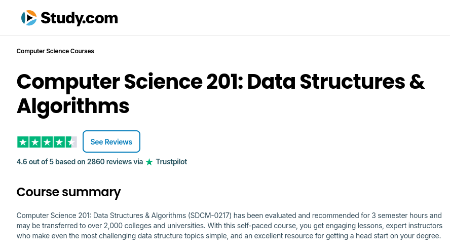

These are the project files and other information for the _Data Structures & Algorithms (CS-201)_ class that I took on [Study.com](https://study.com). 

* Certificate of Completion: https://study.com/member/certificate/courseCertificate.html?urlKey=5936c24a-1b36-46c1-b505-9596627674d2
    * Certificate Verification ID: 5936c24a-1b36-46c1-b505-9596627674d2
* Credly/ACE badge: https://www.credly.com/badges/0b535902-2e95-4c30-9daa-97739cb6ed50

## Coding Projects

### Assignment 1: The Binary Search Tree

This is a solution to the assignment prompt given by [Study.com (n.d.)](https://study.com/academy/lesson/binary-trees-applications-implementation.html), where I implement a binary search tree that can store data in nodes (note that I use "node" and "data" interchangeably in the code), insert new data/nodes, and delete unwanted data/nodes.

Project Files: [Assignment1](./projects/Assignment1)

### Assignment 2: Boyer-Moore Search Algorithm

This is a solution to the assignment prompt given by [Study.com (n.d.-d)](https://study.com/academy/lesson/computer-science-201-assignment-2-searching-text-string-data.html), where I implement the _Boyer-Moore Search Algorithm_ to efficiently find substrings in a text corpus. This utility outputs the index/position where the substring is located.

Project Files: [Assignment2](./projects/Assignment2)

## Selected Citations

* "Geeks4Geeks" (c.a. Feb. 5, 2025). _Balance a Binary Search Tree_. Retrieved on Mar. 12, 2025 from: https://www.geeksforgeeks.org/convert-normal-bst-balanced-bst/
* "Geeks4Geeks" (Mar. 11, 2024). _Boyer Moore Algorithm for Pattern Searching_. Retrieved on Mar. 25, 2025 from: https://www.geeksforgeeks.org/boyer-moore-algorithm-for-pattern-searching/
* Study.com (n.d.). _Binary Trees: Applications & Implementation_. Retrieved on Mar. 6, 2025 from: https://study.com/academy/lesson/binary-trees-applications-implementation.html
* Study.com (n.d.-d). _Computer Science 201 - Assignment 2: Searching Text & String Data_. Retrieved on Mar. 12, 2025 from: https://study.com/academy/lesson/computer-science-201-assignment-2-searching-text-string-data.html

A full list of resources that I cited when programming these utilities can be viewed [here](./citations.md). 

