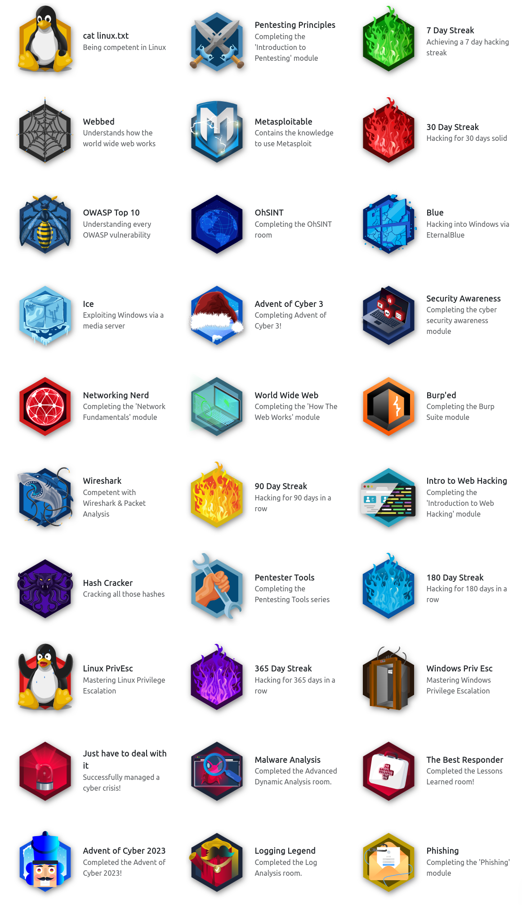

## Accomplishments

Skills Matrix

Badges

Certificates

* [Jr Penetration Tester Learning Path](./images/certs/junior-pentest.pdf)

## Room Grouping

### Learning Pathway

These are a curation of rooms that I completed (or intend to complete) that meets the requirements for a certification in a subject matter:

Red Teaming

* __Red Team Fundamentals:__ Learn the core components of a red team engagement, from threat intelligence to OPSEC and C2s.
    * ~~[Red Team Fundamentals]()~~: Learn about the basics of a red engagement, the main components and stakeholders involved, and how red teaming differs from other cyber security engagements.
    * ~~[Red Team Engagements]()~~: Learn the steps and procedures of a red team engagement, including planning, frameworks, and documentation.
    * ~~[Red Team Threat Intel]()~~: Apply threat intelligence to red team engagements and adversary emulation.
    * ~~[Red Team OPSEC]()~~: Learn how to apply Operations Security (OPSEC) process for Red Teams.
    * ~~[Intro to C2]()~~: Learn the essentials of Command and Control to help you become a better Red Teamer and simplify your next Red Team assessment!
* __Initial Access:__ Explore the different techniques to gain initial access to a target system and network from a Red Teamer’s perspective.
    * ~~[Red Team Recon]()~~: Learn how to use DNS, advanced searching, Recon-ng, and Maltego to collect information about your target.
    * ~~[Weaponization]()~~: Understand and explore common red teaming weaponization techniques. You will learn to build custom payloads using common methods seen in the industry to get initial access.
    * ~~[Password Attacks]()~~: This room introduces the fundamental techniques to perform a successful password attack against various services and scenarios.
    * ~~[Phishing]()~~: Learn what phishing is and why it's important to a red team engagement. You will set up phishing infrastructure, write a convincing phishing email and try to trick your target into opening your email in a real-world simulation.
* __Post Compromise:__ Learn about the steps taken by an attacker right after gaining an initial foothold on a network.
    * ~~[The Lay of the Land]()~~: Learn about and get hands-on with common technologies and security products used in corporate environments; both host and network-based security solutions are covered.
    * ~~[Enumeration]()~~: This room is an introduction to enumeration when approaching an unknown corporate environment.
    * ~~[Windows Privilege Escalation]()~~: Learn the fundamentals of Windows privilege escalation techniques.
    * ~~[Windows Local Persistence]()~~: Learn the most common persistence techniques used on Windows machines.
    * ~~[Lateral Movement and Pivoting]()~~: Learn about common techniques used to move laterally across a Windows network.
    * ~~[Data Exfiltration]()~~: An introduction to Data Exfiltration and Tunneling techniques over various protocols.
* __Host Evasions:__ Understand the techniques behind host-based security and bypass the most common security products in Windows operating systems.
    * ~~[Windows Internals]()~~: Learn and understand the fundamentals of how Windows operates at its core.
    * ~~[Introduction to Windows API]()~~: Learn how to interact with the win32 API and understand its wide range of use cases.
    * ~~[Abusing Windows Internals]()~~: Leverage windows internals components to evade common detection solutions, using modern tool-agnostic approaches.
    * ~~[Introduction to Antivirus]()~~: Understand how antivirus software works and what detection techniques are used to bypass malicious file checks.
    * ~~[AV Evasion: Shellcode]()~~: Learn shellcode encoding, packing, binders, and crypters.
    * ~~[Obfuscation Principles]()~~: Leverage tool-agnostic software obfuscation practices to hide malicious functions and create unique code.
    * ~~[Signature Evasion]()~~: Learn how to break signatures and evade common AV, using modern tool-agnostic approaches.
    * ~~[Bypassing UAC]()~~: Learn common ways to bypass User Account Control (UAC) in Windows hosts.
    * ~~[Runtime Detection Evasion]()~~: Learn how to bypass common runtime detection measures, such as AMSI, using modern tool-agnostic approaches.
    * ~~[Evading Logging and Monitoring]()~~: Learn how to bypass common logging and system monitoring, such as ETW, using modern tool-agnostic approaches.
    * ~~[Living Off the Land]()~~: Learn the essential concept of "Living Off the Land" in Red Team engagements.
* __Network Security Evasion:__ Learn how to bypass and evade different security solutions used in the industry, such as firewalls and IDS/IPS.
    * ~~[Network Security Solutions]()~~: Learn about and experiment with various IDS/IPS evasion techniques, such as protocol and payload manipulation.
    * ~~[Firewalls]()~~: Learn about and experiment with various firewall evasion techniques, such as port hopping and port tunneling.
    * ~~[Sandbox Evasion]()~~: Learn about active defense mechanisms Blue Teamers can deploy to identify adversaries in their environment.
* __Compromising Active Directory:__ Learn and exploit Active Directory networks through core security issues stemming from misconfigurations.
    * ~~[Active Directory Basics]()~~: This room will introduce the basic concepts and functionality provided by Active Directory.
    * ~~[Breaching Active Directory]()~~: This network covers techniques and tools that can be used to acquire that first set of AD credentials that can then be used to enumerate AD.
    * ~~[Enumerating Active Directory]()~~: This room covers various Active Directory enumeration techniques, their use cases as well as drawbacks.
    * ~~[Lateral Movement and Pivoting]()~~: Learn about common techniques used to move laterally across a Windows network.
    * ~~[Exploiting Active Directory]()~~: Learn common AD exploitation techniques that can allow you to reach your goal in an AD environment.
    * ~~[Persisting Active Directory]()~~: Learn about common Active Directory persistence techniques that can be used post-compromise to ensure the blue team will not be able to kick you out during a red team exercise.
    * ~~[Credentials Harvesting]()~~: Apply current authentication models employed in modern environments to a red team approach.

Security Engineer

* __Introduction to Security Engineering:__ Acquire the foundations for security engineering. Learn about security principles, cryptography fundamentals, and identity management basics.
* __Threats and Risks:__ Understand how security engineers help their organisations to identify threats and risks to better manage them.
* __Network and System Security:__ Explore principles of network & system security, including secure protocols, hardening OS, cloud, and network devices using latest techniques.
* __Software Security:__ Understand how security integrates into the development process of an application, and learn how to mitigate common vulnerabilities in web applications.
* __Managing Incidents:__ Understand how security engineers help their organisations during an incident to reduce the impact of the incident.

## Full List of Rooms

These are (hopefully) a full list of TryHackMe rooms (or labs) that I finished, find interesting and intend to do later, are in progress, or some combination of the other aforementioned states. The embedded links in the name of the room point to a "resource folder" of notes that I took while doing the room, and the respective room's materials.

Table of rooms that I have worked on

| __Room__ | __Categories/Tags__ | __THM Description__ | __Level__ | __Time Credits (in minutes)__ | __Status__ |
|----------|---------------------|---------------------|-----------|-------------------------------|------------|
| 25 Days of Cyber Security | [todo] | [todo] | Easy | 0 | Completed |
| Abusing Windows Internals | [todo] | [todo] | Hard | 60 | Completed |
| Active Directory Basics | [todo] | [todo] | Easy | 30 | Completed |
| Active Directory Hardening | [todo] | [todo] | Medium | 120 | Completed |
| Active Reconnaissance | [todo] | [todo] | Easy | 60 | Completed |
| Advanced Static Analysis | [todo] | [todo] | Medium | 200 | Completed |
| Advent of Cyber '23 Side Quest | [todo] | [todo] | Info | 60 | In Progress |
| Advent of Cyber 1 [2019] | [todo] | [todo] | Easy | 0 | In Progress |
| Advent of Cyber 2 [2020] | [todo] | [todo] | [todo] | [todo] | [todo] |
| Advent of Cyber 2022 | [todo] | [todo] | [todo] | [todo] | [todo] |
| Advent of Cyber 2023 | [todo] | [todo] | [todo] | [todo] | [todo] |
| Advent of Cyber 3 (2021) | [todo] | [todo] | [todo] | [todo] | [todo] |
| Agent Sudo | [todo] | [todo] | Easy | 0 | Completed |
| Alfred | [todo] | [todo] | Easy | 45 | Completed |
| Android Hacking 101 | [todo] | [todo] | Medium | 0 | Completed |
| Android Malware Analysis | [todo] | [todo] | Easy | 60 | Completed |
| Anthem | [todo] | [todo] | Easy | 0 | Completed |
| Anti-Reverse Engineering | [todo] | [todo] | Medium | 60 | Completed |
| Atlas | [todo] | [todo] | Easy | 45 | Completed |
| Atomic Red Team | [todo] | [todo] | [todo] | [todo] | [todo] |
| AttackerKB | [todo] | [todo] | [todo] | [todo] | [todo] |
| Attacking Kerberos | [todo] | [todo] | [todo] | [todo] | [todo] |
| [Attacktive Directory](./rooms/attacktivedirectory) | Red Teaming, Active Directory, boot2root | 99% of Corporate networks run off of AD. But can you exploit a vulnerable Domain Controller? | Medium | 0 | Completed |
| Auditing and Monitoring | [todo] | [todo] | [todo] | [todo] | [todo] |
| Aurora EDR | [todo] | [todo] | [todo] | [todo] | [todo] |
| Authenticate | [todo] | [todo] | [todo] | [todo] | [todo] |
| Authentication Bypass | [todo] | [todo] | [todo] | [todo] | [todo] |
| Autopsy | [todo] | [todo] | [todo] | [todo] | [todo] |
| AV Evasion: Shellcode | [todo] | [todo] | [todo] | [todo] | [todo] |
| b3dr0ck | [todo] | [todo] | [todo] | [todo] | [todo] |
| Badbyte | [todo] | [todo] | [todo] | [todo] | [todo] |
| Baron Samedit | [todo] | [todo] | [todo] | [todo] | [todo] |
| Bash Scripting | [todo] | [todo] | [todo] | [todo] | [todo] |
| Basic Dynamic Analysis | [todo] | [todo] | Medium | 120 | Completed |
| Basic Malware RE | [todo] | [todo] | [todo] | [todo] | [todo] |
| Basic Pentesting | [todo] | [todo] | [todo] | [todo] | [todo] |
| Basic Static Analysis | [todo] | [todo] | Medium | 120 | Completed |
| Bebop | [todo] | [todo] | [todo] | [todo] | [todo] |
| Become a Hacker | [todo] | [todo] | [todo] | [todo] | [todo] |
| Becoming a First Responder | [todo] | [todo] | [todo] | [todo] | [todo] |
| Blaster | [todo] | [todo] | [todo] | [todo] | [todo] |
| Blue | Windows, Eternal Blue, MS17-010, boot2root, Exploitation | Deploy & hack into a Windows machine, leveraging common misconfigurations issues. | Easy | 30 | Completed | 
| Bolt | [todo] | [todo] | [todo] | [todo] | [todo] |
| Bounty Hacker | [todo] | [todo] | [todo] | [todo] | [todo] |
| Brim | [todo] | [todo] | [todo] | [todo] | [todo] |
| Bulletproof Penguin | [todo] | [todo] | [todo] | [todo] | [todo] |
| Burp Suite | [todo] | [todo] | [todo] | [todo] | [todo] |
| Burp Suite: Extender | [todo] | [todo] | [todo] | [todo] | [todo] |
| Burp Suite: Extensions | [todo] | [todo] | [todo] | [todo] | [todo] |
| Burp Suite: Intruder (2) | [todo] | [todo] | [todo] | [todo] | [todo] |
| Burp Suite: Intruder | [todo] | [todo] | [todo] | [todo] | [todo] |
| Burp Suite: Other Modules (2) | [todo] | [todo] | [todo] | [todo] | [todo] |
| Burp Suite: Other Modules | [todo] | [todo] | [todo] | [todo] | [todo] |
| Burp Suite: Repeater | [todo] | [todo] | [todo] | [todo] | [todo] |
| Burp Suite: The Basics (2) | [todo] | [todo] | [todo] | [todo] | [todo] |
| Burp Suite: The Basics | [todo] | [todo] | [todo] | [todo] | [todo] |
| Bypass Disable Functions | [todo] | [todo] | [todo] | [todo] | [todo] |
| Bypassing UAC | [todo] | [todo] | [todo] | [todo] | [todo] |
| Careers in Cyber | [todo] | [todo] | [todo] | [todo] | [todo] |
| CC: Ghidra | [todo] | [todo] | Easy | 0 | Completed |
| CC: Pen Testing | [todo] | [todo] | [todo] | [todo] | [todo] |
| CI/CD and Build Security | [todo] | [todo] | [todo] | [todo] | [todo] |
| Cloud-based IaC | [todo] | [todo] | [todo] | [todo] | [todo] |
| Command Injection | [todo] | [todo] | Easy | 20 | Completed |
| Common Attacks | [todo] | [todo] | [todo] | [todo] | [todo] |
| Common Linux Privesc | [todo] | [todo] | [todo] | [todo] | [todo] |
| Container Hardening | [todo] | [todo] | Easy | 40 | Completed |
| Container Vulnerabilities | [todo] | [todo] | Easy | 60 | Completed |
| Content Discovery | [todo] | [todo] | [todo] | [todo] | [todo] |
| Content Security Policy | [todo] | [todo] | [todo] | [todo] | [todo] |
| Cross-site Scripting | [todo] | [todo] | [todo] | [todo] | [todo] |
| Crylo | [todo] | [todo] | [todo] | [todo] | [todo] |
| Cryptography for Dummies | [todo] | [todo] | [todo] | [todo] | [todo] |
| CTF collection Vol. 1 | [todo] | [todo] | [todo] | [todo] | [todo] |
| [Custom Alert Rules in Wazuh](./rooms/customalertrulesinwazuh) | DFIR, EDR, Logging | Learn how to create rules in Wazuh for your environment. | [todo] | [todo] | Easy | 60 | Completed |
| CVE-2021-41773/24013 | [todo] | [todo] | Info | 15 | Completed |
| CVE-2022-26923 | [todo] | [todo] | Easy | 60 | In Progress |
| CVE-2023-38408 | [todo] | [todo] | Medium | 60 | In Progress |
| Cyber Kill Chain | [todo] | [todo] | Easy | 45 | Complete |
| Cyber Scotland 2021 | [todo] | [todo] | Easy | 0 | Completed |
| Daily Bugle | [todo] | [todo] | Hard | 0 | Completed |
| DAST | [todo] | [todo] | Medium | 120 | Completed |
| Data Exfiltration | [todo] | [todo] | Hard | 60 | Completed |
| Dependency Management | [todo] | [todo] | [todo] | [todo] | [todo] |
| DFIR: An Introduction | [todo] | [todo] | Easy | 90 | Completed |
| Diamond Model | [todo] | [todo] | [todo] | [todo] | [todo] |
| [Digital Forensics Case B4DM755](./rooms/caseb4dm755) | Case Study, DFIR | Acquire the critical skills of evidence preservation, disk imaging, and artefact analysis for use in court. | Easy | 120 | Completed | 
| Dirty Pipe: CVE-2022-0847 | [todo] | [todo] | [todo] | [todo] | [todo] |
| Dissecting PE Headers | [todo] | [todo] | [todo] | [todo] | [todo] |
| [Dumping Router Firmware](./rooms/rfirmware) | Case Study, Software Forensics, Reverse Engineering | Have you ever been curious about how your router works? What OS it runs? What makes it tick? | Medium | 0 | Completed |
| DLL HIJACKING | [todo] | [todo] | [todo] | [todo] | [todo] |
| DNS in detail | [todo] | [todo] | [todo] | [todo] | [todo] |
| DNS Manipulation | [todo] | [todo] | [todo] | [todo] | [todo] |
| Dunkle Materie | [todo] | [todo] | [todo] | [todo] | [todo] |
| DVWA | [todo] | [todo] | [todo] | [todo] | [todo] |
| Dynamic Analysis: Debugging | [todo] | [todo] | [todo] | [todo] | [todo] |
| Empire | [todo] | [todo] | [todo] | [todo] | [todo] |
| Encryption – Crypto 101 | [todo] | [todo] | [todo] | [todo] | [todo] |
| Enumeration | [todo] | [todo] | [todo] | [todo] | [todo] |
| [Eradication & Remediation](./rooms/eradicationandremediation) | DFIR, Methodology | A look into the fourth phase of the Incident Response framework: Eradication, Remediation, and Recovery. | Easy | 60 | Completed | 
| Evading Logging and Monitoring | [todo] | [todo] | [todo] | [todo] | [todo] |
| Eviction | [todo] | [todo] | [todo] | [todo] | [todo] |
| Exploit Vulnerabilities | [todo] | [todo] | [todo] | [todo] | [todo] |
| Extending Your Network | [todo] | [todo] | [todo] | [todo] | [todo] |
| ffuf | [todo] | [todo] | [todo] | [todo] | [todo] |
| File Inclusion | [todo] | [todo] | [todo] | [todo] | [todo] |
| Fire Inclusion, Path Traversal | [todo] | [todo] | [todo] | [todo] | [todo] |
| Firewalls | [todo] | [todo] | [todo] | [todo] | [todo] |
| Follina MSDT | [todo] | [todo] | [todo] | [todo] | [todo] |
| Game Zone | [todo] | [todo] | [todo] | [todo] | [todo] |
| Geolocating Images | [todo] | [todo] | [todo] | [todo] | [todo] |
| Getting Started | [todo] | [todo] | [todo] | [todo] | [todo] |
| Google Dorking | [todo] | [todo] | [todo] | [todo] | [todo] |
| Governance & Regulation | [todo] | [todo] | [todo] | [todo] | [todo] |
| Hacking with PowerShell | [todo] | [todo] | [todo] | [todo] | [todo] |
| [HackPark](./rooms/hackpark) | boot2root, Exploitation, Case Study | Bruteforce a websites login with Hydra, identify and use a public exploit then escalate your privileges on this Windows machine! | Medium | 0 | Completed |
| Hardening Basics Part 1 | [todo] | [todo] | [todo] | [todo] | [todo] |
| Hardening Basics Part 2 | [todo] | [todo] | [todo] | [todo] | [todo] |
| Hashing – Crypto 101 | [todo] | [todo] | [todo] | [todo] | [todo] |
| HeartBleed | CTF, Metasploit, Exploitation, Crypto | SSL issues are still lurking in the wild! Can you exploit this web servers OpenSSL? | Easy | 60 | Completed |
| History of Malware | [todo] | [todo] | [todo] | [todo] | [todo] |
| How to use TryHackMe | [todo] | [todo] | [todo] | [todo] | [todo] |
| How websites work | [todo] | [todo] | [todo] | [todo] | [todo] |
| HTTP Request Smuggling | [todo] | [todo] | [todo] | [todo] | [todo] |
| Hunt Me I: Payment Collectors | [todo] | [todo] | [todo] | [todo] | [todo] |
| Hydra | [todo] | [todo] | [todo] | [todo] | [todo] |
| Ice | [todo] | [todo] | [todo] | [todo] | [todo] |
| IDE | [todo] | [todo] | [todo] | [todo] | [todo] |
| [Identification & Scoping](./rooms/identificationandscoping) | Help Desk, Blue Teaming, DFIR | A look into the second phase of the Incident Response Framework, Identification & Scoping. | Medium | 60 | Completed | 
| Identity and Access Management | [todo] | [todo] | [todo] | [todo] | [todo] |
| IDOR | [todo] | [todo] | [todo] | [todo] | [todo] |
| Incident handling with Splunk | [todo] | [todo] | [todo] | [todo] | [todo] |
| Injection | [todo] | [todo] | [todo] | [todo] | [todo] |
| Intro PoC Scripting | [todo] | [todo] | [todo] | [todo] | [todo] |
| Intro to C2 | [todo] | [todo] | [todo] | [todo] | [todo] |
| Intro to Cloud Security | [todo] | [todo] | [todo] | [todo] | [todo] |
| Intro to Containerisation | [todo] | [todo] | [todo] | [todo] | [todo] |
| Intro to Cyber Threat Intel | [todo] | [todo] | [todo] | [todo] | [todo] |
| Intro to Defensive Security | [todo] | [todo] | [todo] | [todo] | [todo] |
| Intro to Detection Engineering | [todo] | [todo] | [todo] | [todo] | [todo] |
| Intro to Digital Forensics | [todo] | [todo] | [todo] | [todo] | [todo] |
| Intro to Docker | [todo] | [todo] | [todo] | [todo] | [todo] |
| Intro to Endpoint Security | [todo] | [todo] | [todo] | [todo] | [todo] |
| Intro to IaC | [todo] | [todo] | [todo] | [todo] | [todo] |
| Intro to IoT Pentesting | [todo] | [todo] | [todo] | [todo] | [todo] |
| Intro to IR and IM | [todo] | [todo] | [todo] | [todo] | [todo] |
| Intro to ISAC | [todo] | [todo] | [todo] | [todo] | [todo] |
| Intro to Kubernetes | [todo] | [todo] | [todo] | [todo] | [todo] |
| Intro to LAN | [todo] | [todo] | [todo] | [todo] | [todo] |
| Intro to Log Analysis | [todo] | [todo] | [todo] | [todo] | [todo] |
| Intro to Logs | [todo] | [todo] | [todo] | [todo] | [todo] |
| Intro to Malware Analysis | [todo] | [todo] | [todo] | [todo] | [todo] |
| Intro to Offensive Security | [todo] | [todo] | [todo] | [todo] | [todo] |
| Intro to Pipeline Automation | [todo] | [todo] | [todo] | [todo] | [todo] |
| Intro To Pwntools | [todo] | [todo] | [todo] | [todo] | [todo] |
| Intro to SSRF | [todo] | [todo] | [todo] | [todo] | [todo] |
| Intro to Threat Emulation | [todo] | [todo] | [todo] | [todo] | [todo] |
| Intro to Windows | [todo] | [todo] | [todo] | [todo] | [todo] |
| Intro to x86-64 | [todo] | [todo] | [todo] | [todo] | [todo] |
| Introduction to Antivirus | [todo] | [todo] | [todo] | [todo] | [todo] |
| Introduction to Cryptography | [todo] | [todo] | [todo] | [todo] | [todo] |
| Introduction to DevSecOps | [todo] | [todo] | [todo] | [todo] | [todo] |
| Introduction to Django | [todo] | [todo] | Easy | 0 | Completed |
| Introduction to Flask | [todo] | [todo] | [todo] | [todo] | [todo] |
| Introduction to OWASP ZAP | [todo] | [todo] | [todo] | [todo] | [todo] |
| Introduction to SIEM | [todo] | [todo] | Easy | 120 | Completed |
| Introduction to Windows API | [todo] | [todo] | Easy | 60 | Completed |
| Introductory Networking | [todo] | [todo] | Easy | 20 | Completed |
| Introductory Researching | [todo] | [todo] | Easy | 0 | Completed |
| [Intrusion Detection](./rooms/idsevasion) | [todo] | [todo] | Medium | 60 | Completed |
| Investigating Windows | DFIR, Case Study, Windows, RDP | A windows machine has been hacked, its your job to go investigate this windows machine and find clues to what the hacker might have done. | Easy | 0 | Completed |
| Investigating Windows 2.0 | [todo] | [todo] | [todo] | [todo] | [todo] |
| Investigating with ELK 101 | [todo] | [todo] | Medium | 180 | In Progress |
| [iOS Forensics](./rooms/iosforensics) | Methodology, Toolkits, DFIR | Learn about the data acquisition techniques and tools used in iOS device digital forensics! | Easy | 0 | Completed |
| ISO27001 | [todo] | [todo] | Easy | 0 | Completed |
| [JavaScript Basics](./rooms/javascriptbasics) | Programming | Learn JavaScript, the high-level, multi-paradigm language of the web. | Easy | 0 | Completed |
| John The Ripper | [todo] | [todo] | Easy | 60 | Completed |
| Junior Security Analyst Intro | [todo] | [todo] | Easy | 15 | Completed |
| Jupyter 101 | [todo] | [todo] | Easy | 0 | Completed |
| [JVM Reverse Engineering](./rooms/jvmreverseengineering) | Java, Reverse Engineering, Case Study | Learn JavaScript, the high-level, multi-paradigm language of the web. | Medium | 0 | In Progress |
| KaffeeSec – SoMeSINT | [todo] | [todo] | Medium | 0 | Completed |
| Kali Machine | Basics | Access your own Kali Machine | Easy | 30 | Completed |
| KAPE | [todo] | [todo] | Medium | 90 | In Progress |
| Kenobi | [todo] | [todo] | Easy | 0 | Completed |
| LazyAdmin | [todo] | [todo] | Easy | 0 | Completed |
| Learn & win prizes - Fall 2022 | [todo] | [todo] | Info | 5 | Completed |
| Learn and win prizes #2 | [todo] | [todo] | Info | 5 | Completed |
| Learn and win prizes | [todo] | [todo] | Info | 0 | Completed |
| Learn Rust | [todo] | [todo] | Easy | 0 | Completed |
| Learning Cyber Security | [todo] | [todo] | Easy | 0 | Completed |
| Legal Considerations in DFIR | [todo] | Medium | 60 | In Progress |
| Lessons Learned | [todo] | [todo] | Easy | 60 | Completed |
| LFI | [todo] | [todo] | Easy | 0 | Completed |
| LFI Basics | [todo] | [todo] | Easy | 0 | Completed |
| Linux Agency | [todo] | [todo] | Medium | 0 | In Progress |
| Linux Backdoors | [todo] | [todo] | Easy | 0 | Completed |
| [Linux File System Analysis](./rooms/linuxfilesystemanalysis) | Methodology, Toolkits, DFIR | Perform real-time file system analysis on a Linux system to identify an attacker's artefacts. | Easy | 60 | Completed | 
| Linux Forensics | [todo] | [todo] | Medium | 120 | Completed |
| Linux Function Hooking | [todo] | [todo] | Medium | 0 | Completed |
| Linux Fundamentals Part 1 | [todo] | [todo] | Info | 10 | Completed |
| Linux Fundamentals Part 2 | [todo] | [todo] | Info | 20 | Completed |
| Linux Fundamentals Part 3 | [todo] | [todo] | Info | 18 | Completed |
| Linux PrivEsc | [todo] | [todo] | Medium | 0 | Completed |
| Linux PrivEsc Arena | [todo] | [todo] | Medium | 0 | Completed |
| Linux Privilege Escalation | [todo] | [todo] | Medium | 50 | Completed |
| Linux Server Forensics | [todo] | [todo] | Medium | 0 | Completed |
| Linux Strength Training | [todo] | [todo] | Easy | 0 | Completed |
| Linux System Hardening | [todo] | [todo] | Medium | 120 | Completed |
| Linux: Local Enumeration | [todo] | [todo] | Easy | 0 | Completed |
| Living Off the Land | [todo] | [todo] | Medium | 60 | Completed |
| LocalPotato | [todo] | [todo] | Medium | 30 | In Progress |
| Log Operations | [todo] | [todo] | Easy | 60 | Completed |
| Log Universe | [todo] | [todo] | Easy | 60 | In Progress |
| Logging for Accountability | [todo] | [todo] | Easy | 60 | Completed |
| MAL: Malware Introductory | [todo] | [todo] | Easy | 0 | Completed |
| MAL: REMnux – The Redux | [todo] | [todo] | Easy | 0 | Completed |
| MAL: Researching | [todo] | [todo] | Easy | 0 | Completed |
| MAL: Strings | [todo] | [todo] | Easy | 0 | Completed |
| MalDoc: Static Analysis | [todo] | [todo] | Medium | 60 | Completed |
| Metasploit | [todo] | [todo] | [todo] | [todo] | [todo] |
| Metasploit: Exploitation | [todo] | [todo] | Easy | 20 | Completed |
| Metasploit: Introduction | [todo] | [todo] | Easy | 30 | Completed |
| Metasploit: Meterpreter | [todo] | [todo] | Easy | 20 | Completed |
| Microsoft Windows Hardening | [todo] | [todo] | [todo] | [todo] | [todo] |
| MISP | [todo] | [todo] | [todo] | [todo] | [todo] |
| MITRE | [todo] | [todo] | [todo] | [todo] | [todo] |
| Mobile Malware Analysis | [todo] | [todo] | [todo] | [todo] | [todo] |
| Mother's Secret | [todo] | [todo] | [todo] | [todo] | [todo] |
| Nessus | [todo] | [todo] | [todo] | [todo] | [todo] |
| Net Sec Challenge | [todo] | [todo] | [todo] | [todo] | [todo] |
| Network Device Hardening | [todo] | [todo] | Medium | 180 | Completed |
| Network Security | [todo] | [todo] | [todo] | [todo] | [todo] |
| Network Security Protocols | [todo] | [todo] | Medium | 180 | Completed |
| Network Security Solutions | [todo] | [todo] | Medium | 120 | Completed |
| Network Services | [todo] | [todo] | Easy | 60 | Completed |
| Network Services 2 | [todo] | [todo] | Easy | 60 | Completed |
| Networking | [todo] | [todo] | Easy | 0 | Completed |
| NetworkMiner | [todo] | [todo] | Easy | 60 | Completed |
| NIS – Linux Part I | [todo] | [todo] | [todo] | [todo] | [todo] |
| Nmap | [todo] | [todo] | [todo] | [todo] | [todo] |
| Nmap Advanced Port Scans | [todo] | [todo] | [todo] | [todo] | [todo] |
| Nmap Basic Port Scans | [todo] | [todo] | [todo] | [todo] | [todo] |
| Nmap Live Host Discovery | [todo] | [todo] | [todo] | [todo] | [todo] |
| Nmap Post Port Scans | [todo] | [todo] | [todo] | [todo] | [todo] |
| NoSQL injection Basics | [todo] | [todo] | Easy | 30 | Completed |
| Obfuscation Principles | [todo] | [todo] | Medium | 60 | Completed |
| OhShint | [todo] | [todo] | Easy | 60 | Completed |
| On-Premises IaC | [todo] | [todo] | Medium | 60 | In Progress |
| OpenCTI | [todo] | [todo] | Medium | 120 | Completed |
| OpenVAS | [todo] | [todo] | Easy | 0 | Completed |
| OpenVPN | [todo] | [todo] | Easy | 0 | Completed |
| Operating System Security | [todo] | [todo] | Easy | 60 | Completed |
| OSI Model | [todo] | [todo] | Info | 30 | Completed |
| Osquery: The Basics | [todo] | [todo] | Easy | 120 | Completed |
| OverlayFS – CVE-2021-3493 | [todo] | [todo] | Info | 0 | Completed |
| Overpass | [todo] | [todo] | [todo] | [todo] | [todo] |
| OWASP API Security Top 10 - 1 | [todo] | [todo] | Medium | 180 | Completed |
| OWASP API Security Top 10 - 2 | [todo] | [todo] | Medium | 180 | Completed |
| OWASP Broken Access Control | [todo] | [todo] | Easy | 30 | Completed |
| OWASP Juice Shop | [todo] | [todo] | Easy | 120 | Completed |
| OWASP Top 10 - 2021 | [todo] | [todo] | Easy | 120 | Completed |
| OWASP Top 10 | [todo] | [todo] | Easy | 120 | Completed |
| Packet & Frames | [todo] | [todo] | Info | 30 | Completed |
| ParrotPost: Phishing Analysis | [todo] | [todo] | Easy | 30 | Completed |
| Passive Reconnaissance | [todo] | [todo] | Easy | 60 | Completed |
| Pentesting Fundamentals | [todo] | [todo] | Info | 30 | Completed |
| Phishing | [todo] | [todo] | Medium | 60 | Completed |
| Phishing Analysis Fundamentals | [todo] | [todo] | Easy | 30 | Completed |
| Phishing Analysis Tools | [todo] | [todo] | Easy | 30 | Completed |
| Phishing Emails in Action | [todo] | [todo] | Easy | 30 | Completed |
| [Phishing: HiddenEye](./rooms/phishinghiddeneye) | Toolkit, Red Teaming | This tool helps you create a phishing page for sites such as Gmail, Snapchat, et cetera. Discussion of the difference between legit and fake site. | Easy | 0 | Completed |
| Phishing Prevention | [todo] | [todo] | Easy | 30 | Completed |
| Physical Security Intro | [todo] | [todo] | Easy | 0 | Completed |
| Pickle Rick | CTF, Case Study, boot2root, dirbuster, Linux | A Rick and Morty CTF. Help turn Rick back into a human! | Easy | 0 | In Progress |
| Polkit: CVE-2021-3560 | [todo] | [todo] | Info | 0 | Completed |
| PowerShell for Pentesters | [todo] | [todo] | Medium | 20 | Completed |
| Preparation | [todo] | [todo] | Easy | 60 | Completed |
| Principles of Security | [todo] | [todo] | Info | 30 | Completed |
| Printer Hacking 101 | [todo] | [todo] | Easy | 0 | In Progress |
| PrintNightmare | [todo] | [todo] | Medium | 30 | Completed |
| Protocols and Servers | [todo] | [todo] | Easy | 100 | Completed |
| Protocols and Servers 2 | [todo] | [todo] | Medium | 100 | Completed |
| Putting it all together | [todo] | [todo] | Easy | 15 | Completed |
| Pwnkit: CVE-2021-4034 | [todo] | [todo] | Info | 15 | Completed |
| Pyramid of Pain | [todo] | [todo] | Easy | 30 | Completed |
| Python Basics | [todo] | [todo] | Info | 80 | Completed |
| Python for Pentesters | [todo] | [todo] | Easy | 30 | Completed |
| Red Team Engagements | [todo] | [todo] | Easy | 90 | Completed |
| Red Team Fundamentals | [todo] | [todo] | Easy | 20 | Completed |
| Red Team OPSEC | [todo] | [todo] | Medium | 90 | Completed |
| Red Team Recon | [todo] | [todo] | Easy | 120 | Completed |
| Red Team Threat Intel | [todo] | [todo] | Medium | 60 | Completed |
| Redline | [todo] | [todo] | Medium | 30 | Completed |
| Registry Persistence Detection | [todo] | [todo] | Easy | 60 | Completed |
| Regular expressions | [todo] | [todo] | Medium | 0 | Completed |
| Remux The Tmux | [todo] | [todo] | Info | 30 | Completed |
| REvil Corp | [todo] | [todo] | Medium | 45 | In Progress |
| Risk Management | [todo] | [todo] | Easy | 90 | Completed |
| Rootme | [todo] | [todo] | Easy | 0 | Completed |
| Runtime Detection Evasion | [todo] | [todo] | Hard | 60 | Completed |
| RustScan | [todo] | [todo] | Easy | 0 | Completed |
| Sakura Room | [todo] | [todo] | Easy | 0 | Completed |
| Sandbox Evasion | [todo] | [todo] | Hard | 180 | In Progress |
| SAST | [todo] | [todo] | Medium | 30 | Completed |
| SDLC | [todo] | [todo] | Easy | 120 | Completed |
| Secure Network Architecture | [todo] | [todo] | Medium | 60 | Completed |
| Security Awareness | [todo] | [todo] | Info | 30 | Completed |
| Security Engineer Intro | [todo] | [todo] | Info | 60 | Completed |
| Security Operations | [todo] | [todo] | Easy | 60 | Completed |
| Security Principles | [todo] | [todo] | Easy | 90 | Completed |
| [Servidae: Log Analysis in ELK](./rooms/servidae) | Log Analysis, DFIR, Blue Teaming, Toolkit | Analyze the logs of an affected workstation to determine the attacker's indicators of compromise. | Easy | 60 | Completed | 
| Shodan.io | [todo] | [todo] | [todo] | [todo] | [todo] |
| Sigma | [todo] | [todo] | Medium | 60 | In Progress |
| Signature Evasion | [todo] | [todo] | Medium | 60 | In Progress |
| Simple CTF | [todo] | [todo] | Easy | 0 | Completed |
| Skynet | [todo] | [todo] | Easy | 0 | Completed |
| Snort | [todo] | [todo] | Medium | 120 | Completed |
| [Snort Challenge - The Basics](./rooms/snortchallenges1) | Blue Teaming, Detection Engineering, Network Analysis, Case Study | Put your snort skills into practice and write snort rules to analyse live capture network traffic. | Medium | 90 | In Progress |
| SOAR | [todo] | [todo] | Medium | 60 | Completed |
| Solar, exploiting log4j | [todo] | [todo] | Medium | 60 | In Progress |
| Splunk 101 | [todo] | [todo] | Easy | 30 | Completed |
| Splunk 2 | [todo] | [todo] | Medium | 45 | In Progress |
| Splunk: Basics | [todo] | [todo] | Easy | 30 | Completed |
| Spring4Shell: CVE-2022-22965 | [todo] | [todo] | Info | 20 | Completed |
| SQL Injection | [todo] | [todo] | Medium | 30 | Completed |
| SQL Injection Lab | [todo] | [todo] | Easy | 0 | In Progress |
| SQLMAP | [todo] | [todo] | Easy | 30 | Completed |
| SSDLC | [todo] | [todo] | Medium | 120 | Completed |
| SSRF | [todo] | [todo] | Medium | 60 | Completed |
| Starting Out in Cyber Sec | [todo] | [todo] | Easy | 0 | Completed |
| Steel Mountain | [todo] | [todo] | Easy | 0 | Completed |
| Subdomain Enumeration | [todo] | [todo] | Easy | 30 | Completed |
| Sublist3r | [todo] | [todo] | Easy | 0 | Completed |
| Sudo Buffer Overflow | [todo] | [todo] | Info | 0 | Completed |
| Sudo Security Bypass | [todo] | [todo] | Info | 0 | Completed |
| Sysinternals | [todo] | [todo] | Easy | 90 | Completed |
| Sysmon | [todo] | [todo] | Easy | 120 | Completed |
| Tardigrade | [todo] | [todo] | Medium | 120 | In Progress |
| The find command | [todo] | [todo] | Easy | 0 | Completed |
| The Greenholt Phish | [todo] | [todo] | Easy | 30 | Completed |
| The Hacker Methodology | [todo] | [todo] | Easy | 0 | Completed |
| The Lay of the Land | [todo] | [todo] | Easy | 60 | Completed |
| TheHive Project | [todo] | [todo] | Medium | 45 | Completed |
| Threat Hunting: Foothold | [todo] | [todo] | Medium | 120 | In Progress |
| Threat Hunting: Introduction | [todo] | [todo] | Easy | 45 | Completed |
| Threat Intel & Containment | [todo] | [todo] | Easy | 30 | Completed |
| Threat Intelligence Tools | [todo] | [todo] | Easy | 60 | Completed |
| Threat Modelling | [todo] | [todo] | Medium | 60 | Completed |
| tmux | [todo] | [todo] | Easy | 20 | Completed |
| ToolsRUs | Dirbuster, nikto, Metasploit, hydra, boot2root | Practise using tools such as dirbuster, hydra, nmap, nikto and metasploit | Easy | 0 | Completed | 
| Tor | [todo] | [todo] | Easy | 0 | Completed |
| Traffic Analysis Essentials | [todo] | [todo] | Easy | 30 | Completed |
| Traverse | [todo] | [todo] | Easy | 120 | Completed |
| Trooper | [todo] | [todo] | Easy | 60 | Completed |
| [TShark](./rooms/tshark) | Network Analysis, Utility | Learn how to use TShark to accelerate your pcap analysis! | Medium | 60 | Completed |
| Tutorial | [todo] | [todo] | Easy | 50 | Completed |
| Unified Kill Chain | [todo] | [todo] | Easy | 40 | Completed |
| Upload Vulnerabilities | [todo] | [todo] | Easy | 0 | In Progress |
| Velociraptor | [todo] | [todo] | Medium | 30 | In Progress |
| Virtualization and Containers | [todo] | [todo] | Easy | 60 | Completed |
| Volatility | [todo] | [todo] | Easy | 30 | In Progress |
| Volatility (2) | [todo] | [todo] | Medium | 60 | Completed |
| Vulnerabilities 101 | [todo] | [todo] | Easy | 20 | Completed |
| Vulnerability Capstone | [todo] | [todo] | Easy | 20 | Completed |
| Vulnerability Management | [todo] | [todo] | Medium | 240 | Completed |
| Vulnversity | [todo] | [todo] | Easy | 0 | Completed |
| Walking An Application | [todo] | [todo] | Easy | 35 | Completed |
| [Wazuh](./rooms/wazuhct) | Sysadmin, EDR, Logging | Wazuh is a free, open source and enterprise-ready security monitoring solution for threat detection, integrity monitoring. | Medium | 160 | Completed |
| Weaponization | [todo] | [todo] | Medium | 120 | Completed |
| Weaponizing Vulnerabilities | [todo] | [todo] | Medium | 120 | Completed |
| Web Application Security | [todo] | [todo] | Easy | 90 | Completed |
| Web Enumeration | [todo] | [todo] | Easy | 0 | Completed |
| Web Fundamentals | [todo] | [todo] | Easy | 30 | Completed |
| Web Scanning | [todo] | [todo] | Easy | 0 | Completed |
| WebOSINT | [todo] | [todo] | Easy | 0 | Completed |
| Welcome | [todo] | [todo] | Easy | 0 | Completed |
| What is Networking? | [todo] | [todo] | Info | 30 | Completed |
| What the Shell? | [todo] | [todo] | Easy | 0 | Completed |
| Wifi Hacking 101 | [todo] | [todo] | Easy | 0 | Completed |
| Win Prizes and Learn - 2023! | [todo] | [todo] | Info | 5 | Completed |
| Windows Applications Forensics | [todo] | [todo] | Medium | 60 | In Progress |
| Windows Base | [todo] | [todo] | Easy | 0 | Completed |
| Windows Event Logs | [todo] | [todo] | Medium | 60 | Completed |
| Windows Forensics 1 | [todo] | [todo] | Medium | 60 | Completed |
| Windows Forensics 2 | [todo] | [todo] | Medium | 70 | Completed |
| Windows Fundamentals 1 | [todo] | [todo] | Info | 30 | Completed |
| Windows Fundamentals 2 | [todo] | [todo] | Info | 30 | Completed |
| Windows Fundamentals 3 | [todo] | [todo] | Info | 30 | Completed |
| Windows Internals | [todo] | [todo] | Medium | 60 | Completed |
| Windows Local Persistence | [todo] | [todo] | Medium | 120 | Completed |
| Windows PrivEsc | [todo] | [todo] | Medium | 0 | Completed |
| Windows PrivEsc Arena | [todo] | [todo] | Medium | 0 | Completed |
| Windows Privilege Escalation | [todo] | [todo] | Medium | 60 | Completed |
| Windows Reversing Intro | [todo] | [todo] | Medium | 60 | Completed |
| [Windows User Account Forensics](./rooms/windowsuseraccountforensics) | [todo] | [todo] | Easy | 27 | In Progress |
| Windows x64 Assembly | [todo] | [todo] | Medium | 25 | Completed |
| Wireshark 101 | [todo] | [todo] | Easy | 60 | Completed |
| Wireshark: Packet Operations | [todo] | [todo] | Easy | 60 | Completed |
| Wireshark: The Basics | [todo] | [todo] | Easy | 60 | Completed |
| Wireshark: Traffic Analysis | [todo] | [todo] | Medium | 120 | Completed |
| XSS | [todo] | [todo] | Easy | 120 | In Progress |
| x86 Assembly Crash Course | [todo] | [todo] | Medium | 120 | Completed |
| Yara | [todo] | [todo] | Easy | 120 | Completed |
| Zeek | [todo] | [todo] | Medium | 120 | Completed |
| Zero Logon | [todo] | [todo] | Hard | 30 | In Progress |

