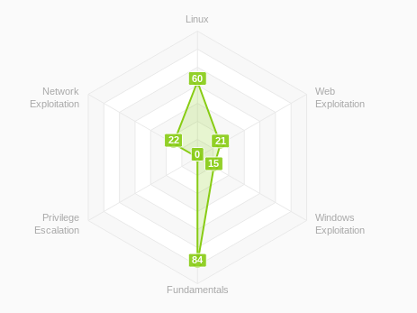

# TryHackMe

### Accomplishments

Badges

| [cat linux.txt](https://tryhackme.com/EntropyThot/badges/terminaled) | [Pentesting Principles](https://tryhackme.com/EntropyThot/badges/intro-to-pentesting) | [7 Day Streak](https://tryhackme.com/EntropyThot/badges/7-day-streak) |
|-|-|-|
| [Webbed](https://tryhackme.com/EntropyThot/badges/web-fund) | [Metasploitable](https://tryhackme.com/EntropyThot/badges/metasploitable) | [30 Day Streak](https://tryhackme.com/EntropyThot/badges/30-day-streak) |
| [OWASP Top 10](https://tryhackme.com/EntropyThot/badges/owasp-10) | [OhSint](https://tryhackme.com/EntropyThot/badges/ohsint) | [Blue](https://tryhackme.com/EntropyThot/badges/blue) |
| [Ice](https://tryhackme.com/EntropyThot/badges/ice) | [Advent of Cyber 3](https://tryhackme.com/EntropyThot/badges/adventofcyber3) | [Security Awareness](https://tryhackme.com/EntropyThot/badges/security-awareness) | 
| [Networking Nerd](https://tryhackme.com/EntropyThot/badges/network-fundamentals) | [World Wide Web](https://tryhackme.com/EntropyThot/badges/world-wide-web) | [Burp'ed](https://tryhackme.com/EntropyThot/badges/burped) |
| [Wireshark](https://tryhackme.com/EntropyThot/badges/wireshark) | [90 Day Streak](https://tryhackme.com/EntropyThot/badges/90-day-streak) | [Intro to Web Hacking](https://tryhackme.com/EntropyThot/badges/intro-to-web-hacking) |
| [Hash Cracker](https://tryhackme.com/EntropyThot/badges/hash-cracker) | [Pentester Tools](https://tryhackme.com/EntropyThot/badges/pentestingtools) | [180 Day Streak](https://tryhackme.com/EntropyThot/badges/180-day-streak)
| [180 Day Streak](https://tryhackme.com/EntropyThot/badges/linux-privesc) | | |

Skills Matrix

### Code Snippets

These are code snippets that I wrote to complete certain rooms:

* [Dawkins.java](./code/Dawkins.java): this is a script that makes use of an evolutionary algorithm to crack a simple XOR cipher \(see [Aleksey 2022](https://medium.com/ai-in-plain-english/a-n-application-of-dawkins-weasel-to-cracking-a-simple-xor-cipher-5459f61dda39) for more info\).
* [js-sort.htm](./code/js-sort.htm): this is a simple javascript driven array sorter for the room "[JavaScript Basics](https://tryhackme.com/room/javascriptbasics)." I have published an implementation of it on CodePen \([here](https://codepen.io/EpsilonCalculus/full/ZEXMxYr)\).
* [PostView.cs](./code/PostView.cs): this is an exploit that I modified to launch a reverse Meterpreter shell via Microsoft's HTA as opposed to a generic reverse shell \(see [Aleksey 2022](https://medium.com/bugbountywriteup/tryhackme-writeup-hackpark-bd9c075c5262) for more info\).
