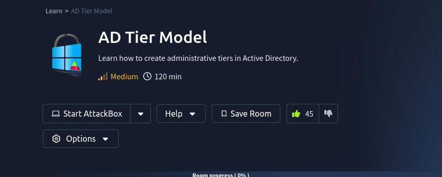

This room consists of two parts:

* [AD Tier Model](https://tryhackme.com/r/room/adtiermodel)
* [AD Tier Model - Workstation](https://tryhackme.com/r/room/adtiermodelwrk)

## Background

## Takeaways

* The __least privilege model__ states that each user are assigned only the most necessary computer privileges to accomplish their work. 
    * This is a good approach to securing computer systems, but it may come at the cost of convience.

