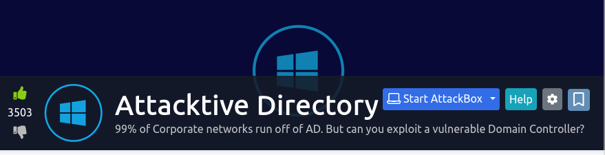

## Background

This room is an introduction to hacking into computer and information systems using Microsoft's [Active Directory](https://learn.microsoft.com/en-us/windows-server/identity/ad-ds/get-started/virtual-dc/active-directory-domain-services-overview).

### Writeups

"Aleksey" (Mar. 14, 2023). _TryHackMe writeup: Attacktive Directory_. InfoSec Write-ups. https://infosecwriteups.com/tryhackme-writeup-attacktive-directory-23d0705e46cb

### Materials

* [userlist.txt](./materials/userlist.txt): a list of usernames to use in brute force.
* [passwordlist.txt](./materials/passwordlist.txt): a list of passwords to use in brute force.
* [hash.txt](./materials/hash.txt): a hash that I was able to dump from the target system.
* [backup_credentials.txt](./materials/backup_credentials.txt): credentials that I obtained via a backup system.

## Takeaways

I already discussed the procedure outlined in the room, so I don't want to get too deep into it. But I do want to list some useful notions that can be employed in future offsec engineering projects:

* __Relevant technologies:__
    * [Active Directory](https://en.wikipedia.org/wiki/Active_Directory): a "directory service developed by Microsoft for Windows domain networks" (quoted from Wikipedia article). They are typically included in Windows Server operating systems.
    * [Kerberos](https://www.techtarget.com/searchsecurity/definition/Kerberos): an authentication system for computer and information systems using Active Directory.

* __Toolkits & Utilities__: these are tools that I used, along with a brief discussion of how I used them:
    * [Impacket](https://github.com/fortra/impacket) is "a collection of Python classes for working with network protocols" (quoted verbatim from their GitHub repo). It was developed by _Core Security_ and _Fortra_.
        * I used its scripts to do various jobs as the situation demanded it: ``GetNPUsers.py`` was used to get the "meta ticket" of the target Active Directory system, ``secretsdump.py`` to dump hashes from a backup SMB share.
    * [Bloodhound](https://github.com/BloodHoundAD/BloodHound) is a tool that uses graphs to work out hidden and "unintended" relationships between different Active Directory entities.
        * [Neo4j](https://neo4j.com/product/neo4j-graph-database/): a graphing library that is used by Bloodhound.
    * [Kerbrute](https://github.com/ropnop/kerbrute/releases): a tool to brute force Kerberos systems.
    * [enum4linux](https://www.kali.org/tools/enum4linux/): a tool for enumerating Windows & Samba Systems.
        * I used this tool to enumerate the target system and get its domain name.
    * [Kerbrute](https://github.com/ropnop/kerbrute): a tool that can be used to brute force Kerberos systems.
        * I used this tool to enumerate the users on the Active Directory target system.
    * [smbclient](https://www.samba.org/samba/docs/current/man-html/smbclient.1.html): utility to access SMB servies.
        * I used this tool to connect to SMB shares on the target system and download useful information (s.a. backup configurations) from them.
    * [Evil-WinRM](https://github.com/Hackplayers/evil-winrm): a weaponised _Windows Remote Management_ cleint purposed for offsec engineering purposes.
        * I used this tool to login to the target Active Directory system by means of _passing the hash__.

