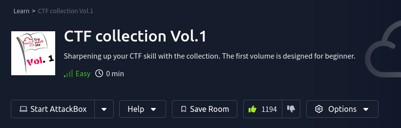

## Background

This is just a simple set of toy problems from the usual _capture the flag_. I do not have a formal writeup for this room, but I do recommend [Issa (2024)](https://infosecwriteups.com/tryhackme-ctf-collection-vol-1-568d7d21e520) --- who I sometimes referenced when I got stuck.

## Takeaways

* Regarding broken images (Task #11):
    * Tools like ``exiftool`` or ``steghide`` can be used for breaking stenography.
    * Make sure that the image header is proper, and use a hex editor to fix an image header if need be (see ["Team NetSPI" 2013](https://www.netspi.com/blog/technical/web-application-penetration-testing/magic-bytes-identifying-common-file-formats-at-a-glance/) regarding "Magic Bytes").

## References

* Issa, A. (Jan. 2024). _TryHackMe CTF Collection Vol. 1_. Retrieved on Apr 9, 2024 from: https://infosecwriteups.com/tryhackme-ctf-collection-vol-1-568d7d21e520
* "Team NetSPI" (Jul. 8, 2013). _Magic Bytes – Identifying Common File Formats at a Glance_. Retrieved on Apr. 9, 2024 from: https://www.netspi.com/blog/technical/web-application-penetration-testing/magic-bytes-identifying-common-file-formats-at-a-glance/

