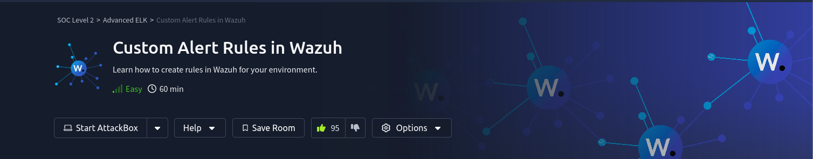

## Background

This room discusses writing custom rules for the _Wazuh_ 

The room (task #1) defines the following objectives:

* Learn how important data is extracted from logs using Decoders.
* Learn how alerts are triggered using Rules.
* Learn how to add new rules to extend detection capabilities.
* Learn how to simulate a real-world attack to test existing rules.

The prerequisites for this room is experience with _Wazuh_ (obviously), _Sysmon_ and _regular expressions_. There are TryHackMe rooms that discuss these concepts for anyone (including this note taker) who needs a refresher in these things.

### Writeup

I don't do a writeup, but I recommend [Alan (2023)](https://medium.com/@josephalan17201972/custom-alert-rules-in-wazuh-tryhackme-write-up-613e8e99a6b3) for anyone interested in a writeup.

### Materials

* Task 2:
    * [windows-decoders-1692027989894.xml](./materials/windows-decoders-1692027989894.xml): this is the XML ruleset for Wazhu "Decoders": which are used to take raw logs and make them easier to read.
        * [task2_sysmon.log](./materials/task2_sysmon.log): These are the raw Sysmon logs.
        * [task2_output.log](./materials/task2_output.log): These are the results of running this rule on the "Ruleset Test".
    * [sysmon-rules-1692028310378.xml](./materials/sysmon-rules-1692028310378.xml): XML ruleset for parsing Sysmon logs.
    * [auditd-rules-1692028627833.xml](./materials/auditd-rules-1692028627833.xml): custom XML ruleset for security audits.

## References

* Alan, J. (Sept. 20, 2023). _Custom Alert Rules in Wazuh TryHackMe Write-Up_. Retrieved on Mar. 26, 2024 from: https://medium.com/@josephalan17201972/custom-alert-rules-in-wazuh-tryhackme-write-up-613e8e99a6b3

