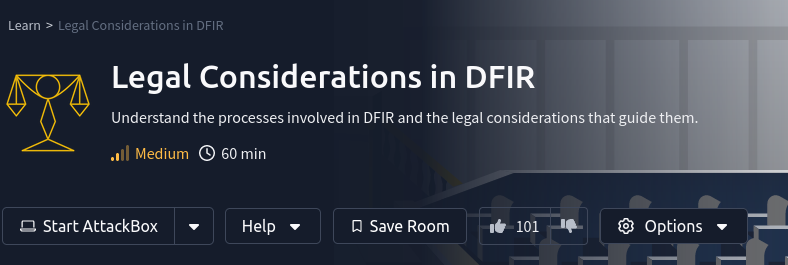

## Background

## Takeaways

### Incident Response and Initial Response:

Some important concepts to know:

* __Utilisation of Designated Channels__: Employing a structured approach for communication, such as a ticketing system for incident reporting and an alternate channel like Signal for urgent communications, ensures that all messages are directed through secure, reliable, and traceable mediums, facilitating efficient and confidential information exchange.
* __Timely Notification__: Key stakeholders, including IT, management, and legal teams, are informed as soon as possible to initiate an immediate and coordinated response.
* __Clarity and Consistency__: Messages are clear, accurate, and consistent, preventing misinformation and panic.
* __Regulatory Compliance__: Communication meets legal and regulatory requirements, mitigating potential legal repercussions.

The components of a robust incident response process:

* __Establishes a Clear Reporting Path__: Constituents are well-informed about the process to follow when they feel or think something is off, ensuring concerns are addressed promptly and effectively.
* __Defines Roles and Responsibilities__: Each member of the IR team knows their tasks and how to communicate their progress to key stakeholders.
* __Ensures Continual Updates__: Regular updates are crucial for adapting strategies as the situation evolves and keeping all parties informed.
* __Facilitates Post-Incident Review__: Effective communication before, during and after an incident contributes to a more efficient review process, identifying lessons learned and areas for improvement.

## References

