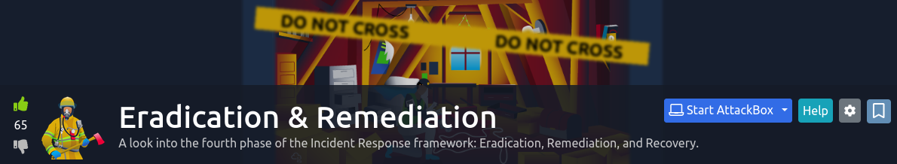

## Background

This room's describes its objectives as:

> "_... tackling the next step of the IR process, giving emphasis to the thought process behind how eradication and remediation works, and touching upon the subject of action plans for recovery._" - quoted from the [THM room (task #1)](https://tryhackme.com/room/eradicationandremediation).

I don't want to do a writeup for this room, but just want to document what I think is noteworthy from doing it.

## Takeaways

* The two steps of the main goal regarding _Eradication & Remediation_ are to:
    * "Eradicate the bad guys" and to do so by working out which computer systems are critical, which one are infected (or both), and then prioritise on how to remediate 
    * Recover from the bad impact caused by the "bad guys"
* "Whack-a-mole" is a "slang" term in cybersecurity where blue team agents get into a cycle of identifying and eradicating "bad guys," and then repeating the process in other parts of the computing environment.
* _Premature eradication_ is when blue team agents attempt to eradicate the "bad guys" off of their computing environment. This lets them know that there is a protocol for eliminating them, which encourages them to try harder.
* _Automated Eradication_ is the use of automated tools like anti-virus or endpoint detection response to automatically eliminate unsophisticated threats.
* A _complete system rebuild_ involves wiping broken computer systems and reinstalling everything. In this context, it aims to get rid of attackers.
    * The big disadvantage of this approach is that it costs too much to do so. 
* A _targeted system cleanup_ is a sophisticated approach to eradicating attackers, which involves gathering intelligence and determining the scope of the attack.
    * Emphasis on __scope__, as a successful targeted system cleanup relies on determining how entrenched the attacker is.
* A _remediation and recovery strategy_ is basically a plan to unravel the damage done by an attacker. It should be used along side eradication techniques.
* _Network Segmentation_, is this context at least, is when network engineers configure how computers are networked in such a way that their communication is limited to only what is necessary.
* The _principle of least privilege_ states that users should only have access to necessary resources or software applications.
* Changes done during the _remediation phase_ are to strengthen the security posture of the organisation.
* Organisations should employ penetration tests and attack simulations to see if their remediation work actually works.

