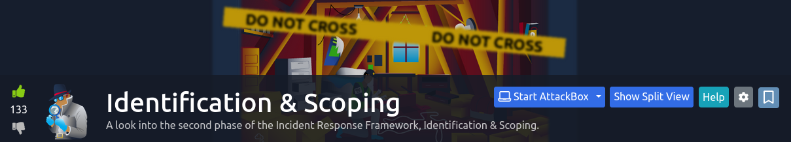

## Background

This is a room that [... fill in ...]. 

It seems like pretty standard stuff, so I won't publish a writeup on it. However, for anyone interested, ["0x4CID" (2023)](https://medium.com/@0x4C1D/tryhackme-identification-scoping-walkthrough-6f3c0f953e3d) published their own writeup (which I occationally referenced when I got stuck doing this room).

### Materials

## Takeaways

* When doing investigations, it is important to think about the social component (the "people"), the technical component (the "technology"), and methodology (or the "process").
* The __Spreadsheet of Doom__ is "a comprehensive directory of malicious indicators that can streamline our investigation process." (quoted verbatim from task #1 of the room). From its name and the examples given, it usually takes the form of a spreadsheet or some kind of tabular dataset.
    * While doing research for this room, I found a resource by the _SANS Institute_ discussing the "Aurora IR", which featured their own spreadsheet of doom "on steroids." See [Fuchs (n.d.)](https://www.sans.org/tools/aurora-ir/).
    * Also see [Fuchs (n.d.-b)](http://web.archive.org/web/20220526175708/https://cyberfox.blog/aurora-incident-response/) for their blog post discussing it.
    
## References

* "0x4C1D" (2023). _TryHackMe — Identification & Scoping walkthrough._ Retrieved on Mar. 13, 2024 from: https://medium.com/@0x4C1D/tryhackme-identification-scoping-walkthrough-6f3c0f953e3d
* Fuchs, M. (n.d.). _Aurora IR._ SANS Institute. Retrieved on Mar. 13, 2024 from: https://www.sans.org/tools/aurora-ir/
* Fuchs, M. (n.d.-b). _Aurora Incident Response._ Archived here: http://web.archive.org/web/20220526175708/https://cyberfox.blog/aurora-incident-response/
