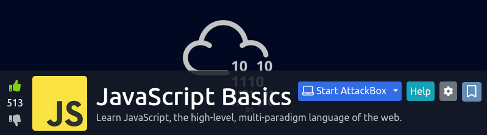

<a href="https://tryhackme.com/room/javascriptbasics" target="_blank"></a>

## Background

This is a room that, like its title suggests, introduces JavaScript to the user. Topics covered includes:

* Programming constructs such as: 
    * _Conditional logic_ 
    * _Functions_ 
    * _Objects and arrays_
    * _Loops_
* The [Document Object Model (DOM)](https://developer.mozilla.org/en-US/docs/Web/API/Document_Object_Model)
* [Cross-site scripting (XSS)](https://owasp.org/www-community/attacks/xss/)

### Materials

* [js-sort.htm](./materials/js-sort.htm): implementation of an inefficient sorting algorithm.
* __CodePen Submission:__ https://codepen.io/EpsilonCalculus/full/ZEXMxYr

## ``bad_sort``

The last task of the room challenges its users to write an JavaScript program to sort an array of numbers from least to greatest. I wrote a function called ``bad_sort`` that attempts to solve this problem:

```javascript
const bad_sort = (x) => {
	y = [];
	do {
		winner = x[0];
		for (let k = 0; k < x.length; k++) {
			if (x[k] < winner) {
				winner = x[k];
			}
		}
		y.push(winner);
		x.splice(x.indexOf(winner), 1);
		
	} while (x.length > 0);
	return y;
};
```

My sorting algorithm looks lite it can be refactored into something more readable, and the algorithm itself appears to be inefficient compared to more standard algorithms like QuickSort.


