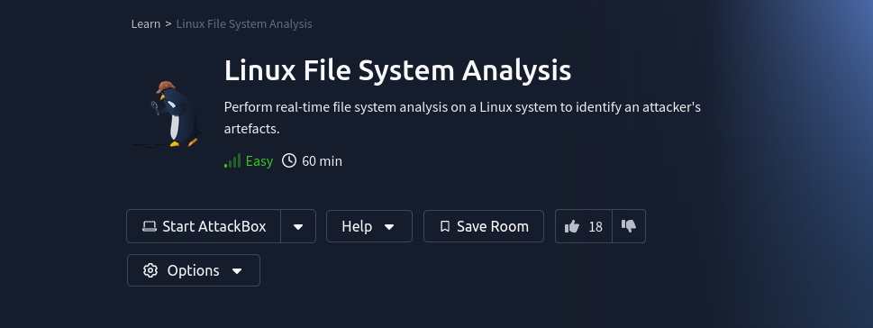

<a href="https://tryhackme.com/r/room/linuxfilesystemanalysis" target="_blank"></a>

## Background

This room concerns itself with a live acquition of the Linux filesystem and its relevant artefacts. The results of the acquition will then be subjected to forensic analysis to then answer the questions of an investigation, like: "_was there any unauthorised access? Were there any malicious activities? Were there any data compromise?_ Et cetera ..." (paraphrased from [THM room, task #1](https://tryhackme.com/r/room/linuxfilesystemanalysis)).

The following are the objectives (quoted verbatim from the [THM room, task #1](https://tryhackme.com/r/room/linuxfilesystemanalysis)):

* Learn how to perform live file system analysis on a Linux system.
* Understand common artefacts, log mechanisms, and file system activities in Linux forensics.
* Reconstruct an event timeline in a hands-on incident response scenario.

In this room, I play the role of a technician in "Penguin Corp" and will be performing a basic file system analysis of a server suspected of being hacked into.

### NOTE when starting the room ...

To start the room, I proceeded by SSHing into the server with username ``investigator`` and password ``TryHackMe123!``, and then proceeded to set environment variables like so:

```
investigator@server:~$ export PATH=/mnt/usb/bin:/mnt/usb/sbin
investigator@server:~$ export LD_LIBRARY_PATH=/mnt/usb/lib:/mnt/usb/lib64
```

## Takeaways

These are the following useful notes that I took while doing this room:

* Regarding __Files, Permissions, and Timestamps__ (Task 3):
    * In UNIX-based systems, there are three basic timestamps:
        * __Modify Timestamp (mtime)__: This timestamp reflects the last time the contents of a file were modified or altered. Whenever a file is written to or changed, its mtime is updated.
        * __Change Timestamp (ctime)__: This timestamp indicates the last time a file's metadata was changed. Metadata includes attributes like permissions, ownership, or the filename itself.
        * __Access Timestamp (atime)__: This timestamp indicates the last time a file was accessed or read. Whenever a file is opened, its atime is updated.
    * ``ls -al [directory]`` lists all the files and properties of the directory.
        * Example: ``ls -al /var/www/html/uploads``
    * ``ls -al [directory] | grep -v ".ext"`` lists all the files and properties of the directory, minus the ones that have the ``.ext`` filename extension.
        * Example: ``ls -al /var/www/html/uploads | grep -v ".jpeg"``
    * ``find / -user [user] -type f 2>/dev/null | less`` makes a list of files created by ``user``
        * Example: ``find / -user www-data -type f 2>/dev/null | less``
    * ``find / -group GROUPNAME 2>/dev/null`` retrieves a list of files and directories owned by a specific group.
    * ``find / -perm -o+w 2>/dev/null`` retrieve a list of all world-writable files and directories.
    * ``find / -type f -cmin -5 2>/dev/null`` retrieve a list of files created or changed within the last five minutes.
    * The ``exiftool`` can be used to analyse files that are not illustrations!
        * Example to analyse an ELF binary: ``exiftool /var/www/html/assets/reverse.elf``
    * ``md5sum`` and ``sha256sum`` are used to calculate the respective MD5 and SHA-256 checksums of a file. 
        * This can be useful when trying to justify the integrity of the investigation.
        * This can also be useful when searching malware databases by file hashes.
    * ``ls -l`` gives the __modify__ in the file timestamp.
    * ``ls -lc [file/directory]`` can be used to view the __change__ in the file timestemp.
        * Example: ``ls -lc /var/www/html/assets/reverse.elf``
    * ``ls -lu [file/directory]`` can be used to view the __access__ in the file timestamp.
        * Example: ``ls -lu /var/www/html/assets/reverse.elf``
    * ``stat`` can be used to get basic statistics of a file (including when it was modified, changed and last accessed)
        * Example ``stat /var/www/html/assets/reverse.elf``
* Regarding __Users and Groups__ (Task 4):
    * Interesting Linux user groups are: 
        * Members of the ``sudo`` (or ``wheel``) group have the authority to execute commands with elevated privileges using sudo.
        * The ``adm`` group typically has read access to system log files.
        * The ``shadow`` group is related to managing user authentication and password information. With this membership, a user can read the ``/etc/shadow`` file, which contains the password hashes of all users on the system.
        * Members of the ``disk`` group have almost unrestricted read and limited write access inside the system.
    * Command to dump account data: ``cat /etc/passwd``
    * Command to get user by its UID: ``cat /etc/passwd | cut -d: -f1,3 | grep ':[uid]$``
        * Example: get ``root`` account: ``cat /etc/passwd | cut -d: -f1,3 | grep ':0$'``
    * Command to get a list of groups: ``cat /etc/group``
    * Command to find out what groups a user belongs to: ``groups [user]``
    * Command to list users belonging to a specific group: ``getent group [group name/id]``
        * Example: ``getent group adm``
        * Example: get users belonging to ``sudo``: ``getent group 27``
    * Command to get user logons and sessions: ``last``
        * Command to get failed user logons: ``lastb``
        * Command to get most recent user logins: ``lastlog`` (it reads from the ``/var/log/lastlog``)
    * Command to get users currently logged into the system: ``who``
    * Regarding ``sudo``, the ``/etc/sudoers`` is a config file that determines what users should be able to execute ``sudo`` and run commands as ``root`` (``uid=0``).
        * An excerpt of a ``sudoers`` entry: ``user   ALL=(ALL) [optional command]``
        * Example: allowing ``richard`` to execute ``ifconfig`` as ``root``: ``richard   ALL=(ALL) /sbin/ifconfig``
* Regarding __User Directories and Files__ (Task #5):
    * Intersting hidden files/folders in a user's home directory:
        * ``.bash_history``: contains a user's command history.
        * ``.bashrc`` and ``.profile``: These are configuration files used to customise a user's Bash shell sessions and login environment, respectively.
        * ``.ssh`` this folder contains configuration and SSH key files used for SSH sessions.
* Regarding __Binaries and Executables__ (Task #6):
    * The ``strings`` command is used to extract strings from binary files.
    * The ``debsums`` command is used to verify the authenticity of a debian package install.
        * Example usage: ``sudo debsums -e -s``
    * Command to identify sticky bits: ``find / -perm -u=s -type f 2>/dev/null``
    * Command to identify a user's usage of Bash or Python utilities: ``sudo cat /home/jane/.bash_history | grep -B 2 -A 2 "python"``
* Regarding __Rootkits__ (Task #7):
    * The ``chkrootkit`` utlity is used to hunt down rootkits on a *NIX system. 
    * ``rkhunter`` is another utility that is used to hunt down rootkits on a *NIX system (now with a live database).
        * Example usage: ``sudo rkhunter -c -sk``

## References


