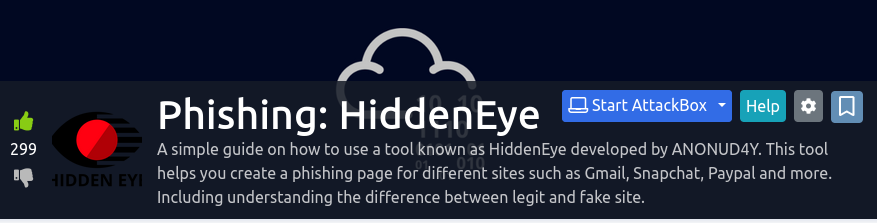

## Background

[HiddenEye](https://gitlab.com/an0nud4y/HiddenEye) is a toolkit used to automate the phishing process. Its features include:

* Multiple tunneling services for hosting the phishing page
* Thirty-four (34) different login page templates, plus/including custom webpage templates
* Keylogger in the target's web browser

The use of the toolkit is pretty straightforward. I don't think that I need to write anything up here, but will just keep it as a reference.

## References

* Currently hosted at: https://gitlab.com/an0nud4y/HiddenEye
    * Previously hosted at (note that this may lead to 404 error page): https://github.com/DarkSecDevelopers/HiddenEye.git 

