

## Background

This room discusses research methods for reverse engineering and hacking router firmware. 

## Walkthrough

__NOTE:__ that when I got stuck, I referenced ["Adharv" (2023)](https://medium.com/@Akv0x/tryhackme-dumping-router-firmware-akv0x-2c55e47158e4)'s writeup when I got stuck. This is to give them acknowledgements.

### Setup

* In order, I ran the following commands to get the RCE tools setup:
    * ``sudo pip install cstruct;``
    * ``git clone https://github.com/sviehb/jefferson;``
    * ``cd jefferson && sudo python setup.py install``
* For this room, I used the [Linksys WRT1900ACS v2 Firmware](https://github.com/Sq00ky/Dumping-Router-Firmware-Image/) as a case study. I rebuilt the firmware by:
    * Cloning the repository: ``git clone https://github.com/Sq00ky/Dumping-Router-Firmware-Image/ /opt/Dumping-Router-Firmware && cd /opt/Dumping-Router-Firmware/``
    * Unzipping the archive: ``7z x ./FW_WRT1900ACSV2_2.0.3.201002_prod.zip``
    * Verifying the integrity of the extracted image: ``sha256sum FW_WRT1900ACSV2_2.0.3.201002_prod.img``

The image SHA256 checksum should work out to: ``dbbc9e8673149e79b7fd39482ea95db78bdb585c3fa3613e4f84ca0abcea68a4``, and it indeed does!

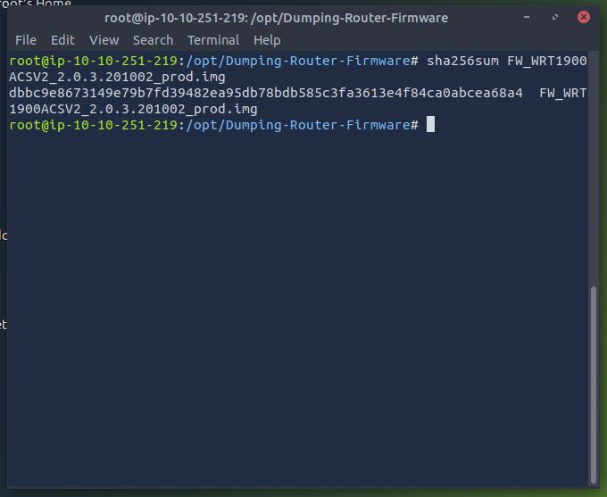

### Investigating the image

I started by running ``strings`` against the dumped image: 

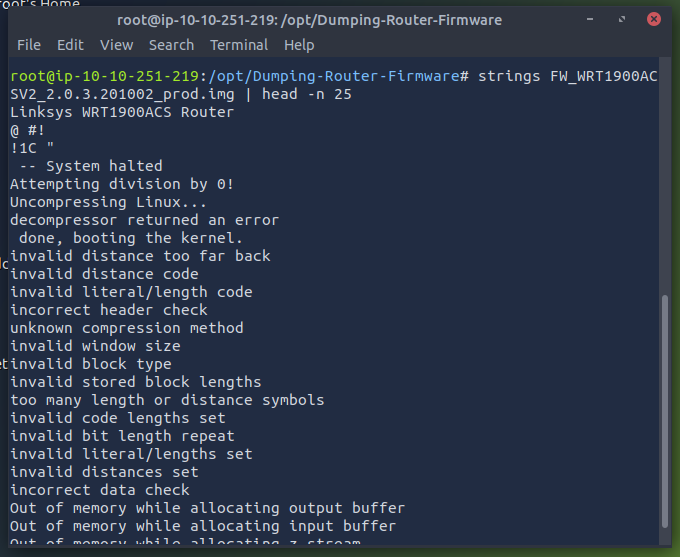

From this, I was able to confirm that it is firmware for the [Linksys WRT1900ACS Router](https://www.linksys.com/support-product?sku=WRT1900ACS) and that it is running Linux. I then proceeded to investigate the image with ``binwalk -e [image file]`` --- by using it to further extract the ``.img`` file's contents:

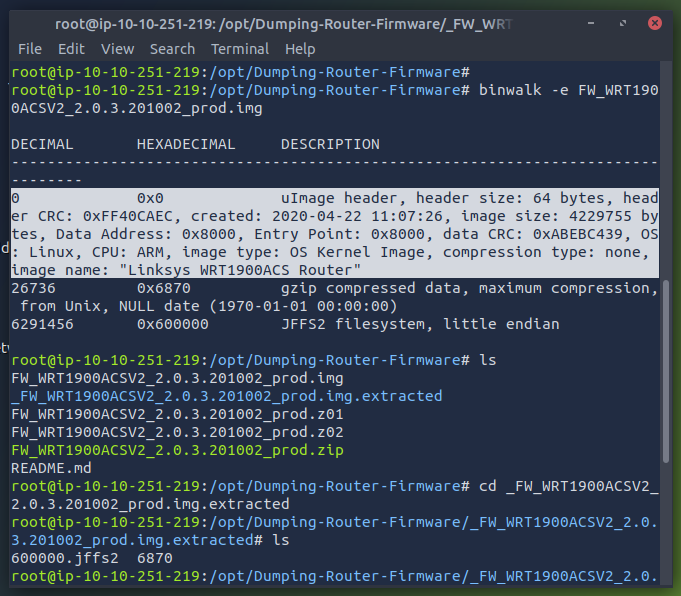

The first thing that was extracted is the ``uImage header``, and it was created in Apr. 22, 2020 at around 11:07, has a CRC of 0xABEBC439, and an image size of 4229755 bytes. This ``uImage header`` also runs on the [ARM architecture](https://www.arm.com/architecture). 

I then proceeded to dump the strings of an extracted artefact called ``6870`` ...

... and then extracted its contents with ``binwalk -e``:

I learnt quite a few interesting things from the binwalk dump: like how the Linux kernel version is ``3.10.39`` and that it was compiled with ``gcc`` compiler tools:

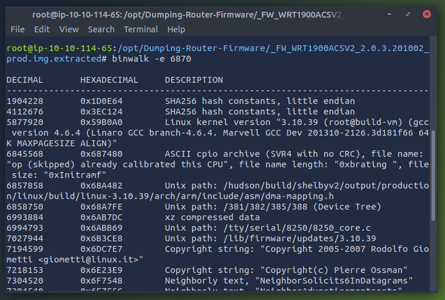

I also dumped ``799E38.cpio`` with the ``strings`` command ...

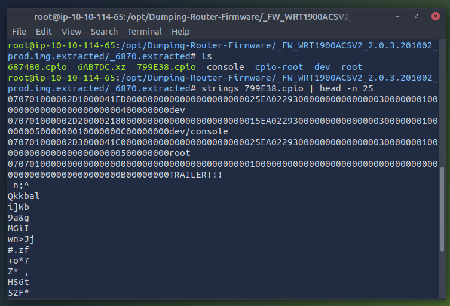

... and what I saw so far did not seem useful (but may show itself to be useful later). I then dumped the contents of it with ``binwalk -e`` ...

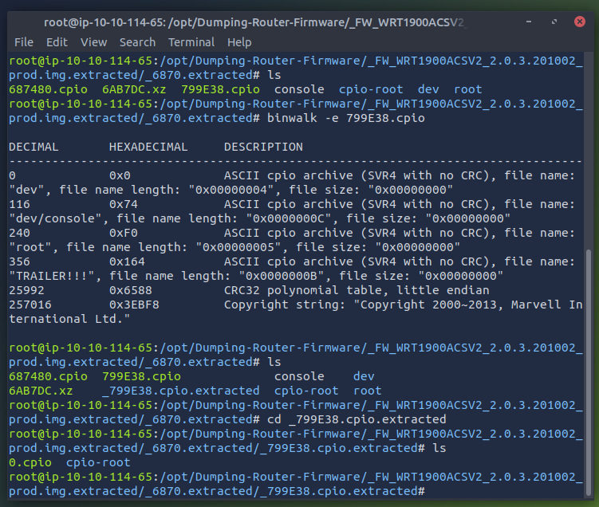

### Investigation of the Router's Filesystem

Here, I mounted the Linksys Router's extracted filesystem onto the current analyst instance (note that I copypasta'd commands when I got stuck :p):

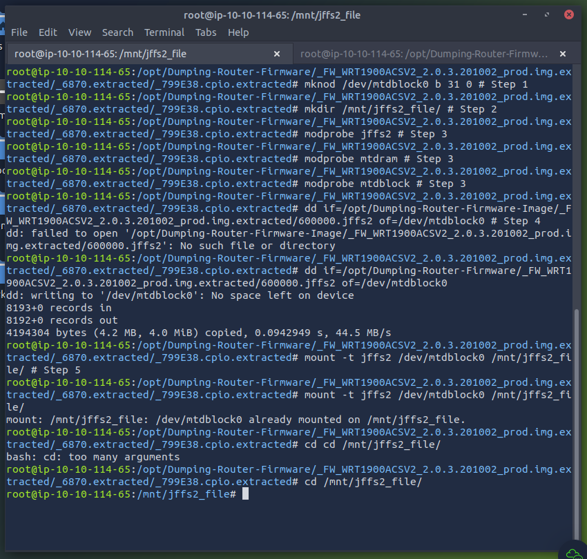

I then dumped its filesystem contents:

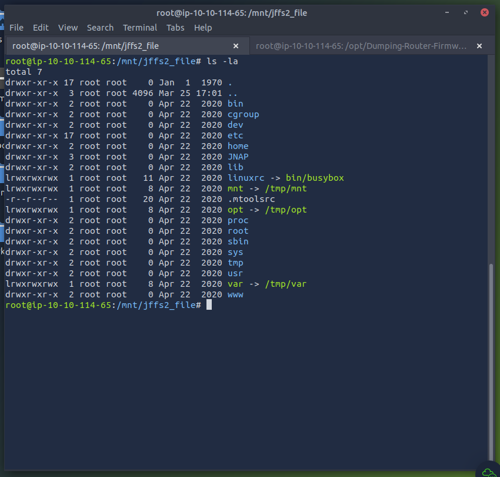

I also examined the ``bin`` folder to see what kind of utilities are used by the Linksys router:

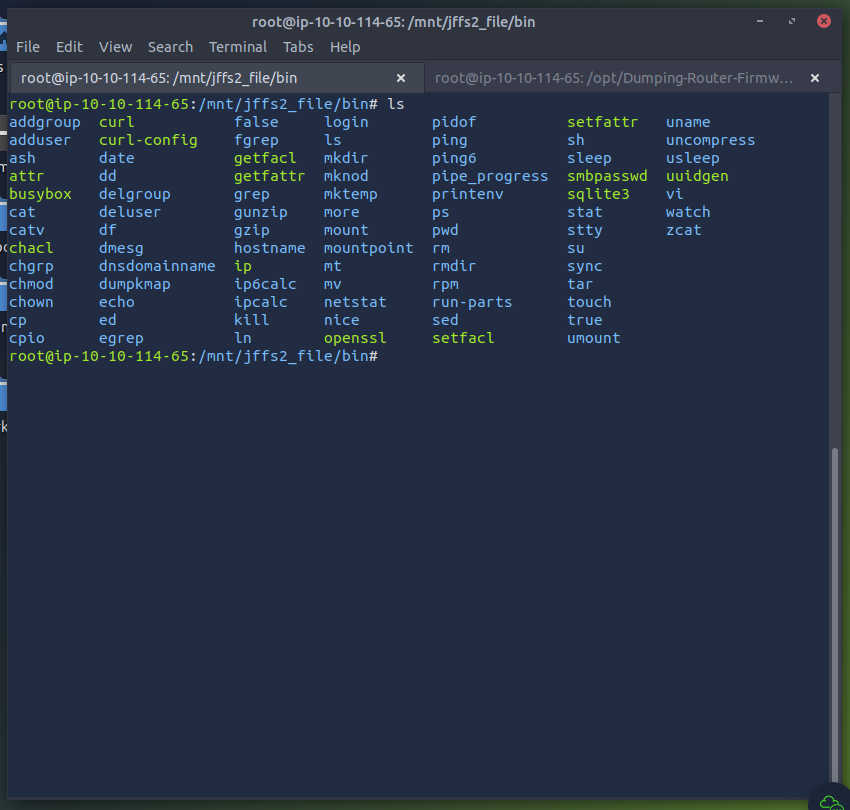

I learnt quite a few things from this cursory assessment of the filesystem: 

* That the Linksys router uses ``busybox``.
* That it stores its HTTP server files in the ``/www/`` directory.
* That it uses the ``sqlite3`` driver as a SQL database.

I also explored its ``/etc/`` folder:

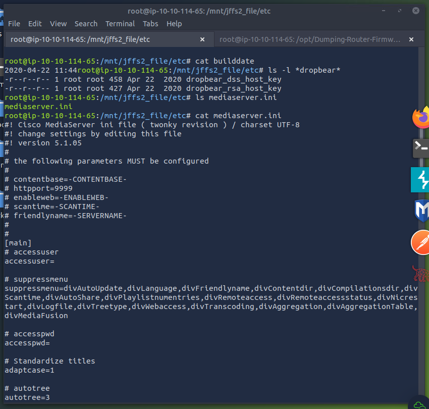

From this, I learnt that it was built on Apr. 22, 2020 at 11:44 A.M., that it uses the ``dropbear`` SSH service, and it has a media server developed by Cisco. 

Other things worth noting:

* The common services file is stored in ``/etc/services``
* The default system settings are stored in ``/etc/system_defaults``
* The firmware version is stored in ``/etc/version``
    * After running ``cat version``, it is discovered to be ``2.0.3.201002``.
    
I also decided to briefly investigate the ``/JNAP/modules`` folder:

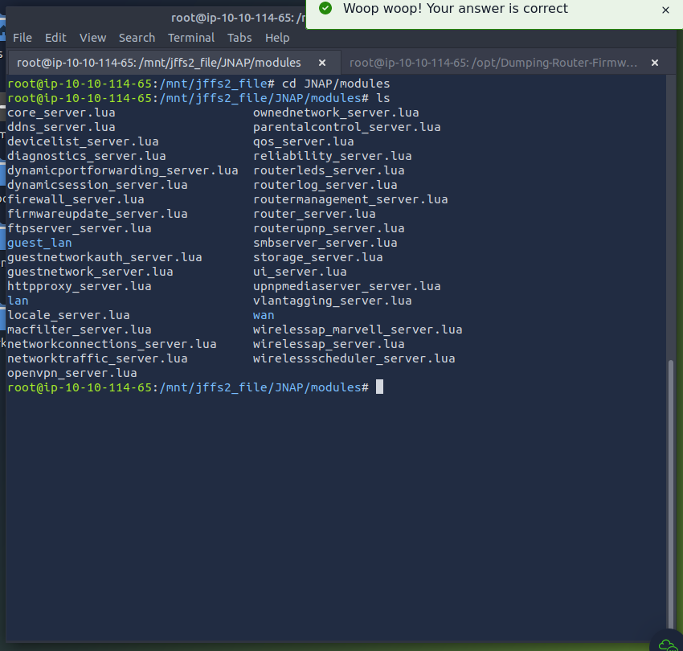

## Takeaways

* When installing, make sure to have the following tools:
    * Linux distribution with ``strings`` and ``binwalk`` tools.
    * ``binwalk`` needs [JFSS2 support](https://github.com/ReFirmLabs/binwalk/blob/master/INSTALL.md).
* CRC stands for "Cyclical Redundancy Check" and it is like hashing in the sense that is is used "to ensure that the file contents were not corrupted and/or modified in transit." \(quoted verbatim from [THM Room, task #2](https://tryhackme.com/r/room/rfirmware)\).
* [Ubuntu Forums (n.d.)](https://ubuntuforums.org/archive/index.php/t-846852.html) discusses what ``busybox`` is, how it works, and what makes it different from traditional desktop utilities.
* The following GitHub repo has tools for interacting with JNAP which can be used for reverse engineering purposes: https://github.com/jakekara/jnap
* An article by [Horowitz (2016)](https://routersecurity.org/hnap.php) discusses the _Home Network Administration Protocol_, which he does not recommend for routers as it is insecure. Linksys still has this vulnerable service on its routers at the time of the room's publication.

## References

* "Adharv" (Jul. 19, 2023). _Tryhackme-Dumping Router Firmware-Akv0x_. Retrieved on Mar. 25, 2024 from: https://medium.com/@Akv0x/tryhackme-dumping-router-firmware-akv0x-2c55e47158e4
* ARM Architecture (n.d.). _Get started using Arm architecture and technology with our how-to guides and tutorials_. Retrieved on Mar. 23, 2024 from: https://www.arm.com/architecture
* Horowitz, M. (Nov. 14, 2016). _HNAP - Router Security_. Retrieved on Mar. 25, 2024 from: https://routersecurity.org/hnap.php
* Linksys WRT1900ACS Router (n.d.). Retrieved on Mar. 23, 2024 from: https://www.linksys.com/support-product?sku=WRT1900ACS
* ONEKEY Security (n.d.). _Jefferson: JFFS2 filesystem extraction tool_. GitHub Repository. Retrieved on Mar. 23, 2024 from: https://github.com/onekey-sec/jefferson/
* ReFirmLabs (n.d.). _INSTALL.md: Before You Start_. Retrieved on Mar. 23, 2024 from: https://github.com/ReFirmLabs/binwalk/blob/master/INSTALL.md
* Sq00ky (n.d.). _Dumping-Router-Firmware-Image. GitHub Repository. Retrieved on Mar. 23, 2024 from: https://github.com/Sq00ky/Dumping-Router-Firmware-Image/
* Ubuntu Forums (Jul. 2, 2008). _What's so special about Busy Box Linux? Why do routers often use this OS?_ Retrieved on Mar. 25, 2024 from: https://ubuntuforums.org/archive/index.php/t-846852.html
* Viehböck, S. (n.d.). _jefferson: JFFS2 filesystem extraction tool (archived)_. GitHub Repository. Retrieved on Mar. 23, 2024 from: https://github.com/sviehb/jefferson

