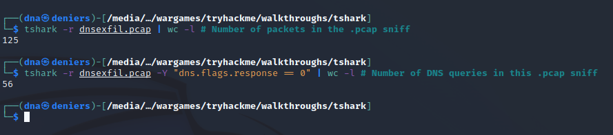

<a href="https://tryhackme.com/room/tshark" target="_blank"></a>

## Background

[tshark](https://www.wireshark.org/docs/man-pages/tshark.html) is a command-line utility that comes with the _Wireshark toolkit._ It can be installed into a Debian Linux-based system with the command: ``sudo apt install tshark``

### Materials

* [dns.cap](./pcaps/dns.cap) and [dnsexfil.pcap](./pcaps/dnsexfil.pcap): the pcap files given to analyse.
* [dump.txt](./dump.txt): relevant DNS response data for exfiltration.
* [decode.py](./decode.py): Python script which will read ``dump.txt`` and extract the exfiltration data.

## Basic Usage

| __``tshark`` usage__ | __Description__ |
|----------------------|-----------------|
| ``tshark -r [cap file]`` | Dumps contents of ``[cap file]`` in a ``tcpdump`` style output. It can be piped into ``wc -l`` to get the number of packets outputted. |
| ``tshark -r [cap file] -Y [filter]`` | Dumps contents of ``[cap file]`` filtered out by wireshark ``[filter]`` after command argument (``-Y``). |
| ``tshark -r [cap file] -Y [filter] -T fields -e [field name]`` | Dump the contents of the cap file and ``[filter]`` out the unnecessary stuff, and just output the column ``-T fields -e [field name]``. |

## Example: Basic Usage on Packet Sniff

I won't spend too much time here, but just list out some examples for examining a basic DNS packet sniff:

* Commands to ...
    * List the number of packets in the .pcap file: ``tshark -r dns.cap | wc -l``
    * List the number of DNS ``A`` records in a .pcap file: ``tshark -r dns.cap -Y "dns.qry.type == 1" | wc -l``
    * Work out the DNS ``A`` record that is the most frequent: ``tshark -r dns.cap -Y "dns.qry.type == 1" -T fields -e dns.qry.name``

## Example: DNS Exfiltration

Task 3 from the _tshark_ room makes for an excellent case study for how to use ``tshark``. ``dnsexfil.pcap`` contains packet data from a situation that uses the DNS protocol to exfiltrate data. I will start by using ``tshark`` to ask basic questions about the packet file



``dns.flags.response == 0`` is a Wireshark filter that instructs the packet filtering utility to show only DNS responses. Next, I wanted to inspect the contents of the packet dump. I did so by running ``tshark -r dnsexfil.pcap``:


The above figure is an excerpt of the output, and I noticed a suspicious DNS query with the code ``0xbeef`` and a domain, ``m4lwhere.org`` with a subdomain containing a single alphanumeric character. I suspect that each subdomain response value is a piece of a string, so I dumped just the domains into a text file:


I just needed the subdomain, so I wrote the following Python script to get it:

```python
with open("dump.txt", "r") as domains_dump:
    data_exfiltrated = ""
    for domain in domains_dump.readlines():
        data_exfiltrated += domain[0]
    print(data_exfiltrated)
```

Running the script gives the string: ``MZWGCZ33ORUDC427NFZV65BQOVTWQX3XNF2GQMDVG5PXI43IGRZGWIL5``, which I have identified as [base32 encoded](https://en.wikipedia.org/wiki/Base32). Decoding it results in: 


