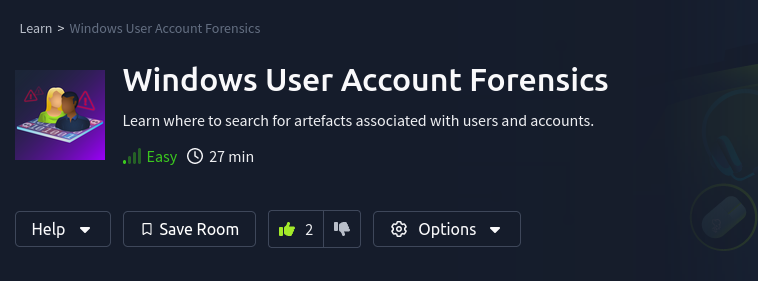

## Background

The learning objectives, as quoted verbatim from this room (task #1), are to:

* Identify and analyze forensic artefacts related to user and system accounts in Windows.
* Understand the forensic aspects of the user account lifecycle, including creation, modification, and deletion.
* Detect malicious activities through behavioural analysis and threat detection techniques.
* Investigate Group Policy Objects (GPOs) for security insights and potential exploitation.
* Apply forensic analysis techniques in practical scenarios to enhance investigative skills.

Basically, it's a computer forensics room that focuses on Windows User Accounts and tried to do attribution given  user account information.

## Takeaways

* Regarding different kinds of user accounts (task #2):
    * There are three different kinds of user accounts: Local User Accounts, Domain Accounts, System and Service Accounts.
    * Local user accounts are user accounts for a specific computer.
    * Domain accounts are for the entire Windows domain, and managed through a domain controller.
    * System and Service Accounts are special accounts used by Windows apps or the Windows operating system itself.

## References

