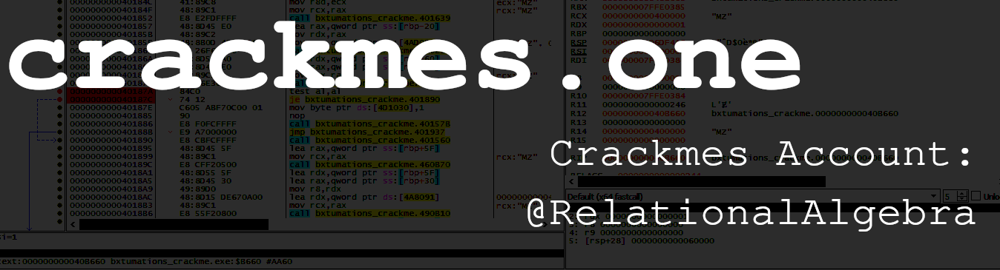

crackmes profile: https://www.crackmes.one/user/RelationalAlgebra

# Solutions

The following is a table of ``crackmes.one`` puzzles, and links to writeups that I have done

| __CrackMe ID__ | __Title__ | __Project Files__ | __Language__  | __Platform__ | __Quality__ | __Difficulty__ | __Writeup (on__   |
|----------------|-----------|-------------------|---------------|--------------|-------------|----------------|-------------------|
|                |           |                   |               |              |             |                | __crackmes.one)__ |
| [6115567333c5d45db85dc17a](https://crackmes.one/crackme/6115567333c5d45db85dc17a) | Easiest Crackme | [here](./writeups/6115567333c5d45db85dc17a) | .NET | Windows | 1.4 | 3.4 | [here](https://crackmes.one/static/solution/61a33da033c5d413767c9c33.zip) |
| [6194f35633c5d44c61906fe6](https://crackmes.one/crackme/6194f35633c5d44c61906fe6) | f-crackme | [here](./writeups/6194f35633c5d44c61906fe6) | C/C++ | Windows | 1.5 | 4.3 | [here](https://crackmes.one/static/solution/61bc2dff33c5d413767c9f2c.zip) |
| [66ae3a8390c4c2830c821832](https://crackmes.one/crackme/66ae3a8390c4c2830c821832) | easycrackme | [here](./writeups/66ae3a8390c4c2830c821832) | C/C++ | Windows | 2.2 | 5.0 | _in review_ |

## Note That Regarding the Solutions Table

* ZIP archives coming from the ``crackmes`` website are password protected, so when downloading my writeups (or any other material) published onto their website, use the password ``crackmes.one`` or ``crackmes.de`` to unzip the files.
* Regarding some of the columns in the above table:
    * The __"Writeup (on crackmes.one)"__ column is a direct link to the ``crackmes.one`` website. I directly link to their site because, according to [their FAQ](https://web.archive.org/web/20241117143438/https://crackmes.one/faq), they have place in some quality control mechanism to make sure that submitted solutions make sense.
    * The __"Project Files"__ column contains a link to a folder in this repository of the respective solution's project files, which contain a local copy of the writeup, and some of the materials that I used to derive a solution.

# Quality Control Mechanisms for Writeups

## The proof-of-concept

Some are inclined to ask, "how can we be sure that Aleksey's solutions are of decent quality and standards?" I will give two answers: the first involves the work standing on its own merit. In hacking, the best approach to determine if a particular "hack" works properly is for other hackers to reproduce my work - which manifests itself as a "[proof-of-concept](https://en.wikipedia.org/wiki/Proof_of_concept)." My writeups detail the procedures that I used for deriving a key or writing a keygen application, which will allow for others to reproduce my work.

## ``crackmes.one`` Submission Verification

Sometimes, I will submit my solutions to the ``crackmes.one`` website and put a direct link to the solution from the ``crackmes.one`` domain. On the [crackmes.one FAQ](https://web.archive.org/web/20241117143438/https://crackmes.one/faq), the website administrators note that they have a mechanism by which they only publishe good  writeups, and rejects low quality writeups. When faced with the complaint that: "I submitted a crackme/solution but it does not appear on the website," ``crackmes.one`` responds with:

> "Every crackme/solution is validated before appearing on the website. This may take anywhere from a few hours to a couple of days." - quoted verbatim from [crackmes.one FAQ](https://web.archive.org/web/20241117143438/https://crackmes.one/faq).

Furthermore, when faced with the more severe complaint: "My solution does not appear on the website after many days," ``crackmes.one`` replies with:

> "This is probably because your solution got rejected. Please, upload an explaination of how you managed to solve the crackme, not just a simple keygen.py file. More generally there's only one rule: don't patch! Unless the author explicitely said that patching is a valid solution, don't do it. Write your keygen, write your solution. You'll learn more by doing this." - quoted verbatim from [crackmes.one FAQ](https://web.archive.org/web/20241117143438/https://crackmes.one/faq).

This indicates that submitted writeups go through some semblance of a quality control mechanism. Unfortunately, the ``crackmes.one`` admins do not elaborate what makes for a quality writeup - beyond the rule that software patching is forbidden unless explicitly permitted by the author - so writeups published onto the ``crackmes.one`` website cannot be given the distinction of "peer review." But nonetheless, there is a semblance of a quality control mechanism put into place. This implies that while writeups published onto their website have not earned the distinction of "peer reviewed," they nonetheless are more likely to be of higher quality than a self-published blog post.

